## Carte du cours

::: {.carte-du-cours}
:::

::: {.notes}
Cette diapo est fabriquée automatiquement à partir des étiquettes de niveau
posées sur les diapos. Rien à tenir à jour à la main.
:::

## Une carte du monde, il y a 2 600 ans {.veille}

:::: {.columns}
::: {.column width="38%"}
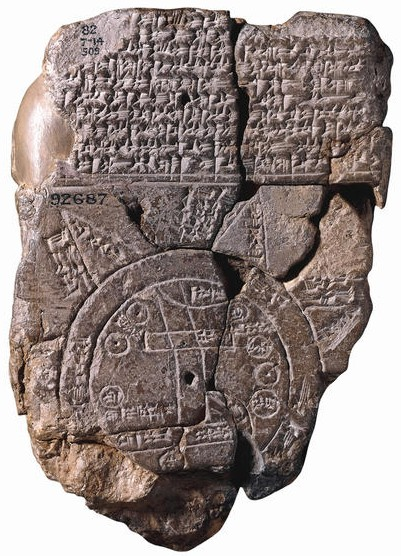{fig-alt="Tablette d'argile babylonienne gravée d'une carte circulaire du monde" height="410"}

[VII^e^ siècle av. J.-C., British Museum]{.legende}
:::
::: {.column width="62%"}
1. Le golfe Persique entoure le monde, comme une rivière.
2. Le rectangle supérieur est **Babylone**.
3. Les ronds situent les villes voisines.
4. Le rectangle inférieur figure les marais du sud de la Mésopotamie.
5. L'Euphrate et le Tigre coulent vers le golfe.
6. Les triangles, au-delà du cercle, sont les régions inconnues.
:::
::::

::: {.notes}
Irak, VIIe siècle avant J.-C. Besoin de comprendre l'espace et les phénomènes
qui lui sont liés. Trois ensembles : le milieu, le sujet et l'objet.
La carte est avant tout un outil pour se mouvoir : repérage et orientation.
:::

## Mercator, 1595 {.image-pleine .veille}

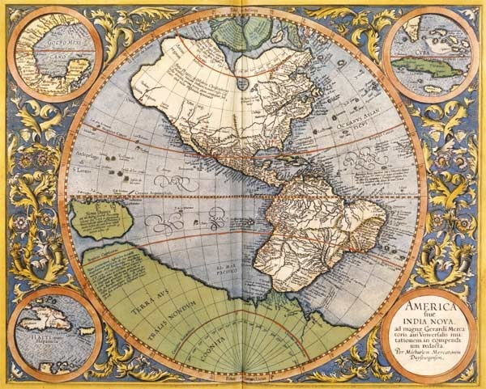{fig-alt="Carte de l'Amérique de Mercator, 1595, ornée de médaillons"}

::: {.notes}
La carte devient un outil de navigation : la projection de Mercator conserve
les angles, donc les caps. On y revient dans la deuxième partie.
:::

## La forme de la Terre {.intercalaire}

Où suis-je ? Encore faut-il savoir sur quoi l'on se repère.

## Mesurer la Terre avec une ombre {.appui}

:::: {.columns}
::: {.column width="62%"}
::: {.question etiquette="Prédiction"}
Le même jour, à midi, le Soleil éclaire le fond d'un puits à Syène.
À Alexandrie, 5 000 stades plus au nord, un bâton vertical projette une ombre.

**Que peut-on en déduire, et avec quelle précision ?**
:::

::: {.reponse}
L'ombre mesure 1/50^e^ de cercle : la Terre fait donc 50 × 5 000 stades.

[39 375 km]{.chiffre}

Ératosthène, III^e^ siècle av. J.-C. La valeur admise aujourd'hui est d'environ 40 000 km.
:::
:::
::: {.column width="38%"}
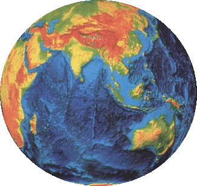{fig-alt="Globe terrestre en relief"}
:::
::::

::: {.notes}
La Terre plate d'Homère devient sphérique avec Aristote. Augustin doute de
l'existence des antipodiens, pas de la sphéricité. La vraie question sera
géocentrisme ou héliocentrisme (Galilée).
:::

## De la sphère à l'ellipsoïde {.socle}

:::: {.columns}
::: {.column width="55%"}
Newton et Cassini s'opposent sur la forme de la Terre : allongée ou aplatie aux pôles ?
On mesure donc la méridienne, en France puis en Laponie avec Maupertuis.

[La Terre est aplatie aux pôles : une vingtaine de kilomètres d'écart entre les deux rayons.]{.a-retenir}

Sur l'ellipsoïde, un point est repéré par :

- sa **longitude λ**, depuis un méridien d'origine ;
- sa **latitude φ**, depuis l'équateur ;
- sa **hauteur h** au-dessus de l'ellipsoïde.
:::
::: {.column width="45%"}
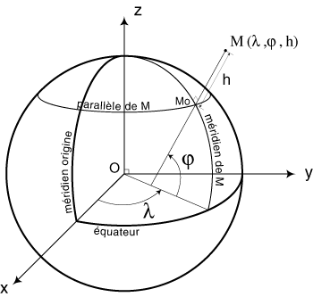{fig-alt="Schéma d'un point M repéré par sa longitude, sa latitude et sa hauteur sur l'ellipsoïde"}
:::
::::

::: {.notes}
Kepler s'intéresse au mouvement des planètes, les « astres errants » ; on mesure
des trajectoires en ellipse. Cassini et Newton introduisent l'idée d'une forme
elliptique pour la Terre elle-même.
:::

## Le géoïde : la référence des altitudes {.socle perle="EXEMPLE-01"}

:::: {.columns}
::: {.column width="50%"}
L'altitude doit suivre l'écoulement des eaux, donc la **gravité**.

On mesure le niveau moyen des mers (en France, au marégraphe de Marseille) et on prolonge cette surface sous les continents : c'est le **géoïde**.

[La hauteur *h* au-dessus de l'ellipsoïde n'est pas une altitude.]{.a-retenir}

L'écart entre les deux surfaces atteint quelques dizaines de mètres.
:::
::: {.column width="50%"}
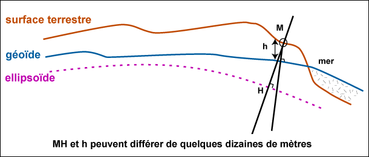{fig-alt="Profil comparant la surface terrestre, le géoïde et l'ellipsoïde"}

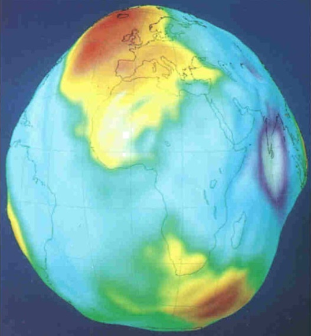{fig-alt="Carte des ondulations du géoïde" height="185"}
:::
::::

::: {.notes}
Ce serait la forme de la Terre s'il n'y avait qu'un immense océan.
Causes des ondulations : masses internes, épaisseur de la croûte, attraction des astres.
:::

## Dans quel ordre ? {.socle}

::: {.ordre}
Du monde réel aux coordonnées que l'on lit dans un SIG : remettez la chaîne dans l'ordre.

1. La Terre réelle
2. Le géoïde
3. L'ellipsoïde
4. Le système géodésique
5. La projection
6. Les coordonnées planes
:::

## Quel système géodésique en France ? {.socle}

:::: {.columns}
::: {.column width="52%"}
::: {.qcm}
Lequel est le système légal en France métropolitaine ?

- [ ] NTF
    - C'était le cas jusqu'en 2000. Système local, issu d'une triangulation.
- [ ] ED50
    - Système européen, local lui aussi.
- [x] RGF93
    - Oui. Système spatial, légal depuis le décret de 2000.
- [ ] WGS84
    - C'est le système du GPS. Très proche du RGF93, mais ce n'est pas le système légal.
:::
:::
::: {.column width="48%"}
::: {.reponse etiquette="À retenir"}
| Système | Local | Spatial |
|---------|:-----:|:-------:|
| NTF     | ✓     |         |
| ED50    | ✓     |         |
| RGF93   |       | ✓       |
| WGS84   |       | ✓       |

Chaque pays a d'abord mesuré la Terre avec ses propres outils. Les satellites ont permis des systèmes mondiaux.
:::
:::
::::

## Le passage au plan {.intercalaire}

Aplatir une surface courbe, c'est forcément la déformer.

## Projeter, c'est choisir ce que l'on conserve {.socle}

:::: {.columns}
::: {.column width="56%"}
### Conforme
Conserve localement les **angles** et les formes. Géodésie, topographie, navigation.

### Équivalente
Conserve les **surfaces**. Cartographie thématique.

### Aphylactique
Ne conserve ni l'un ni l'autre : un compromis. Les projections équidistantes en font partie.
:::
::: {.column width="44%"}
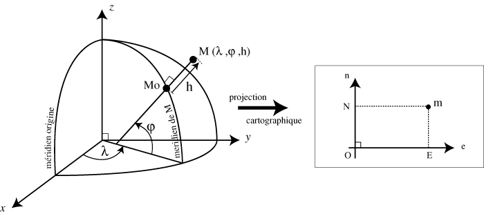{fig-alt="Passage des coordonnées géographiques aux coordonnées planes"}

[Aucune projection ne conserve à la fois les angles, les surfaces et les distances.]{.a-retenir}
:::
::::

## Où Mercator exagère-t-elle le plus ? {.appui}

:::: {.columns}
::: {.column width="62%"}
::: {.zones image="images/proj-mercator.jpg" alt="Planisphère en projection de Mercator"}
- [x] 30,0,16,22 : Le Groenland paraît aussi grand que l'Afrique. Il est en réalité 14 fois plus petit.
- [x] 0,80,100,20 : L'Antarctique s'étire sur toute la largeur de la carte. Plus on approche des pôles, plus les surfaces enflent.
- [ ] 45,33,17,30 : L'Afrique est à cheval sur l'équateur : c'est là que les surfaces sont les plus justes.
- [ ] 27,44,14,34 : L'Amérique du Sud est peu déformée, sauf à sa pointe.
:::
:::
::: {.column width="38%"}
La projection de Mercator est **conforme** : elle garde les angles, donc les caps.

Le prix à payer se lit sur les surfaces.

::: {.reponse etiquette="Comparer"}
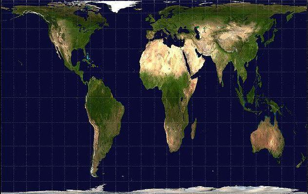{fig-alt="Planisphère en projection de Peters, équivalente" height="150"}

[Projection de Peters, équivalente]{.legende}
:::
:::
::::

## Trois familles de canevas {.appui}

:::: {.columns}
::: {.column width="33%"}
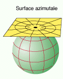{fig-alt="Plan tangent à la sphère" height="230"}

### Azimutal
Un plan tangent à l'ellipsoïde.
:::
::: {.column width="33%"}
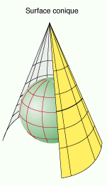{fig-alt="Cône posé sur la sphère" height="230"}

### Conique
Un cône tangent ou sécant. *Ex. : Lambert.*
:::
::: {.column width="33%"}
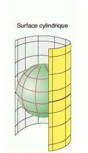{fig-alt="Cylindre entourant la sphère" height="230"}

### Cylindrique
Un cylindre tangent ou sécant. *Ex. : UTM.*
:::
::::

## Les neuf coniques conformes {.veille .optionnel}

Le Lambert 93 altère trop les longueurs pour certains travaux de géomètre.

Neuf projections **CC42 à CC50** le complètent : une zone de 2° de latitude chacune, centrée sur un parallèle de degré entier, avec une altération inférieure à 9 cm/km.

::: {.legende}
Diapo marquée `.optionnel` : elle disparaît d'un coup avec l'option « masquer les optionnelles ».
:::

## La référence aujourd'hui : Lambert 93 {.socle}

:::: {.columns}
::: {.column width="46%"}
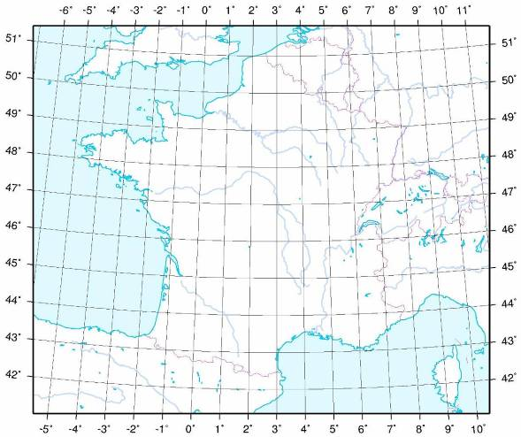{fig-alt="Carte de France dans le quadrillage Lambert 93"}
:::
::: {.column width="54%"}
| Paramètre | Valeur |
|-----------|--------|
| Système géodésique | RGF93 |
| Ellipsoïde | IAG-GRS 1980 |
| Projection | conique conforme |
| Origine | 46°30′ N, 3° E |
| Parallèles d'échelle conservée | 44° N et 49° N |
| E~0~ / N~0~ | 700 000 m / 6 600 000 m |

Dans un SIG, c'est le code **`EPSG:2154`**.
:::
::::

## Quel code pour les niveaux ? {#codes}

::: {.codes-niveau}
:::

::: {.legende}
Diapo de travail, à retirer ensuite. Le code A est celui appliqué dans tout ce support.
:::

## À vous {.fin}

Ouvrez QGIS et vérifiez le système de coordonnées de votre projet.
