## Que regardent-elles ?

:::: {.columns}
::: {.column width="52%"}
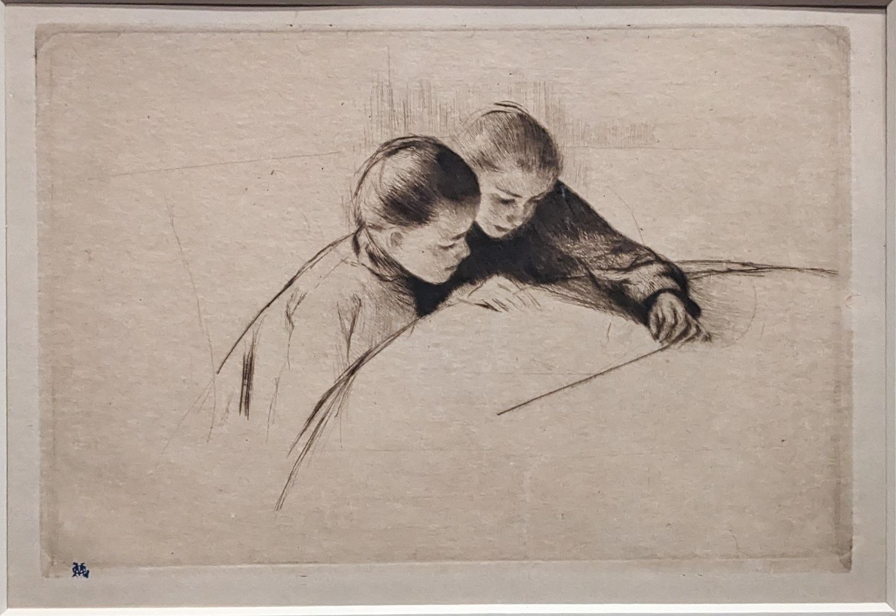{fig-alt="Deux fillettes penchées sur une carte de géographie, gravure de Mary Cassatt"}

[Mary Cassatt, *La Leçon*, 1890, pointe sèche]{.legende}
:::
::: {.column width="48%"}
::: {.question}
Elles n'ont pas quitté la pièce, et pourtant elles voyagent.

**Que peut-on savoir d'un lieu sans y être allé ?**
:::

::: {.reponse}
Une carte n'est pas le monde. C'est une représentation que l'on interroge, et une esquisse du réel.
:::
:::
::::

::: {.notes}
En novembre 1890, cette pointe sèche fait la une du premier numéro de L'Art dans les Deux Mondes,
la revue de Paul Durand-Ruel. Une artiste qui a un pied dans chaque monde, deux fillettes
qui examinent une carte de géographie.
:::

## Carte du cours

::: {.carte-du-cours}
:::

::: {.notes}
Deux mouvements. Trois regards : lever les yeux, regarder l'horizon, regarder d'en haut.
Puis un aller-retour : monter du plan au géoïde pour comprendre, redescendre pour calculer.
Les exemples ne figurent pas ici : ils illustrent, ils ne sont pas à réviser.
:::

## Représenter, c'est choisir {.socle}

:::: {.columns}
::: {.column width="50%"}
::: {.schema fichier="images/schemas/milieu-sujet-objet.svg"}
:::
:::
::: {.column width="50%"}
Toute carte met en relation trois choses :

- un **milieu**, trop riche pour être montré en entier ;
- un **sujet**, qui regarde avec une intention ;
- un **objet**, ce que l'on décide de faire voir.

[Une carte ne montre pas tout : elle tranche.]{.a-retenir}
:::
::::

::: {.notes}
Besoin de comprendre l'espace et les phénomènes qui lui sont liés.
Ces représentations de l'espace sont liées à des fonctions. Demander des exemples.
:::

## À quoi sert une carte ? {.socle}

:::: {.columns}
::: {.column width="46%"}
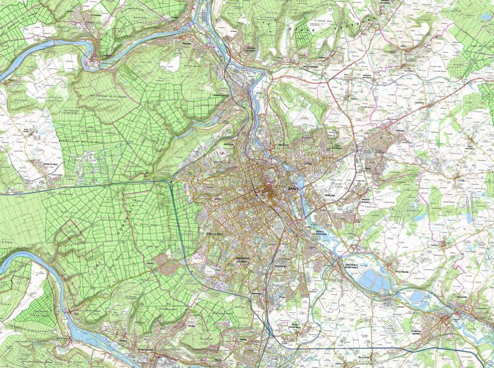{fig-alt="Carte topographique au 1:25 000 des environs de Nancy"}

[Les environs de Nancy au 1:25 000]{.legende}
:::
::: {.column width="54%"}
::: {.qcm}
Que permet cette carte ? Plusieurs réponses sont justes.

- [x] Se repérer
    - Savoir où l'on est, par rapport à ce qui nous entoure.
- [x] S'orienter
    - Savoir dans quelle direction regarder.
- [x] Se déplacer
    - Choisir un chemin avant de l'emprunter.
- [x] Contrôler un territoire
    - Oui aussi : elle descend en droite ligne de la carte d'état-major.
- [x] Penser
    - Comparer, mesurer, imaginer ce que l'on ne voit pas depuis le sol.
:::
:::
::::

## Avant l'écriture

:::: {.columns}
::: {.column width="62%"}
::: {.zones image="images/bedolina.jpg" alt="Gravure rupestre de Bedolina : rectangles ponctués, lignes sinueuses et petites constructions"}
- [x] 40,49,12,19 : Un rectangle semé de points réguliers : on y lit un champ, ou un enclos.
- [x] 30,20,11,13 : Une ligne sinueuse qui relie les parcelles : un chemin, ou un cours d'eau.
- [x] 48,66,30,26 : Des constructions à toit pointu : des maisons ou des greniers, ajoutés plus tard.
:::
:::
::: {.column width="38%"}
À Bedolina, dans le Val Camonica, une roche gravée il y a environ trois mille ans.

Retrouvez **un champ**, **un chemin**, **une maison**.

[Abstraire un territoire précède l'écriture.]{.a-retenir}
:::
::::

::: {.notes}
Nord de l'Italie, Val Camonica. Une capacité d'abstraction antérieure à l'écriture.
Se confronter à un environnement à appréhender.
:::

## Lever les yeux {.intercalaire}

Premier regard : se situer dans le cosmos.

## Le monde vu de Babylone

:::: {.columns}
::: {.column width="42%"}
::: {.zones image="images/tablette-babylone.jpg" alt="Tablette d'argile babylonienne gravée d'une carte circulaire du monde"}
- [x] 34,50,18,7 : Le rectangle supérieur : Babylone.
- [x] 39,57,8,17 : Les deux traits parallèles : l'Euphrate, qui coule vers le golfe.
- [x] 22,52,9,24 : L'anneau : une eau qui encercle le monde connu.
- [x] 54,38,14,11 : Un triangle au-delà du cercle : une région mystérieuse.
:::
:::
::: {.column width="58%"}
Irak, VII^e^ siècle av. J.-C.

Cherchez sur la tablette :

- **Babylone** ;
- **l'Euphrate** ;
- **l'eau** qui entoure le monde ;
- une **région inconnue**.

[British Museum]{.legende}
:::
::::

::: {.notes}
Le golfe Persique est dessiné comme une rivière encerclant le monde.
Les ronds autour de Babylone situent des villes. Le rectangle inférieur représente
les régions marécageuses du sud de la Mésopotamie.
C'est avant tout un outil pour se mouvoir : repérage et orientation.
:::

## Des mondes en forme de mythes {.optionnel}

:::: {.columns}
::: {.column width="40%"}
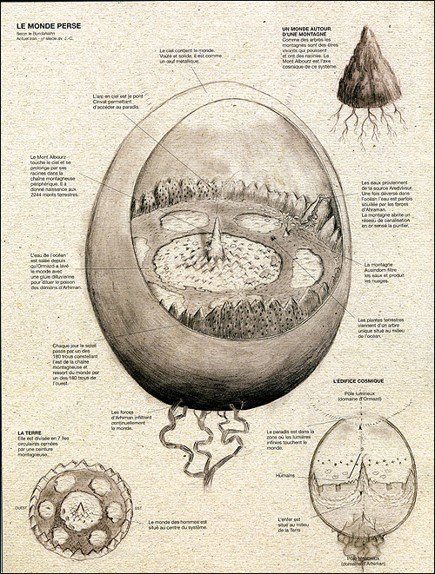{fig-alt="Planche illustrée du monde selon la cosmogonie perse : un œuf contenant la Terre"}
:::
::: {.column width="60%"}
Chaque culture donne au monde la forme de son récit : un œuf, un disque, une montagne.

On élabore le monde comme une limite entre le connu et l'inconnu.

[D'après L. Haddad et G. Duprat, *Mondes, mythes et images de l'univers*]{.legende}
:::
::::

::: {.notes}
Cette connaissance va passer par la géométrie. Cartographie et géométrie seront liées pendant un temps.
:::

## Le connu et l'illimité {.veille}

:::: {.columns}
::: {.column width="46%"}
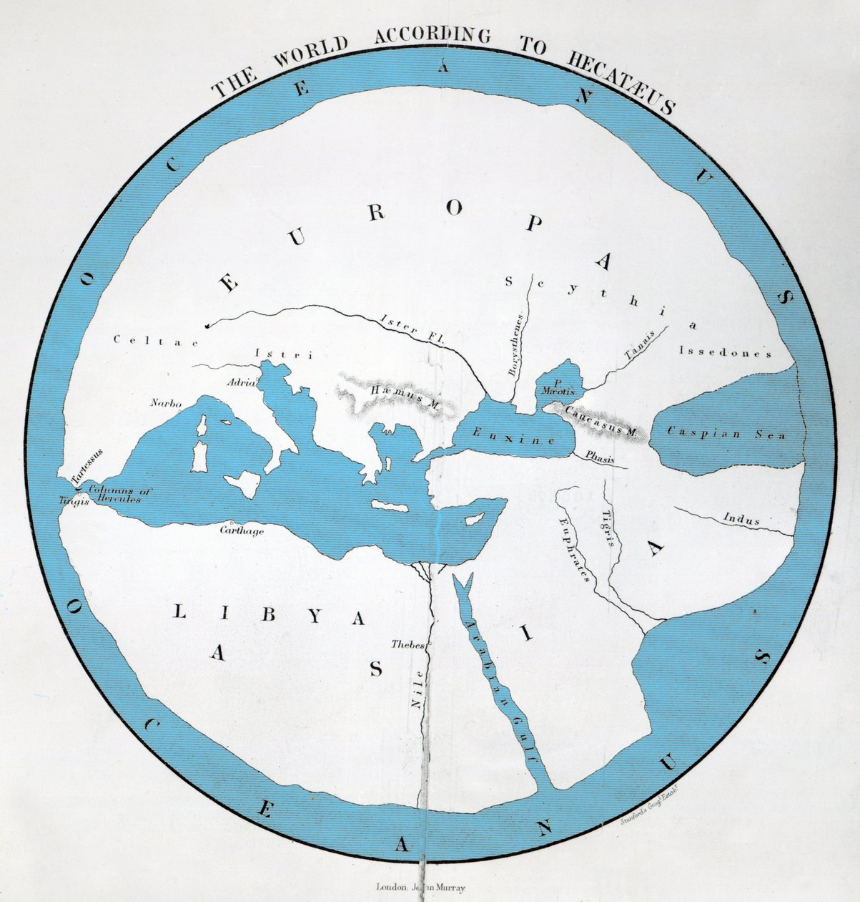{fig-alt="Le monde selon Hécatée : un disque de terres autour de la Méditerranée, entouré par l'Océan" height="430"}
:::
::: {.column width="54%"}
Vers 500 av. J.-C., Hécatée de Milet dessine un disque : l'Europe, l'Asie, la Libye, autour d'une mer.

- **L'œkoumène** : la terre habitée, le monde connu.
- **L'apeiron** : l'illimité, la mer sans bord qui l'entoure.

La carte trace d'abord une frontière.

[Reconstitution publiée par John Murray]{.legende}
:::
::::

::: {.notes}
On change d'échelle par rapport au cadastre. Pour Thalès de Milet, la Terre est semblable
à un navire flottant sur un immense océan. Anaximandre et Hécatée publient les premières cartes du monde.
:::

## Comment savoir que la Terre est ronde ? {.appui}

::: {.question etiquette="Prédiction"}
Vous n'avez ni avion ni satellite. **Quelles observations suffisent ?**
:::

::: {.reponse}
::: {.schema fichier="images/schemas/rotondite.svg"}
:::
:::

::: {.notes}
Aristote avance l'ombre de la Terre pendant les éclipses et le changement des étoiles visibles.
Demander aux étudiants d'en proposer d'autres.
:::

## Mesurer la Terre avec une ombre {.appui}

:::: {.columns}
::: {.column width="52%"}
::: {.curseur min="2" max="30" pas="0.1" valeur="7.2" unite="°" etiquette="Angle de l'ombre à Alexandrie" schema="images/schemas/eratosthene.svg" hauteur="270"}
- Tour de la Terre : `{5000*360/x|0}` stades
- Soit `{5000*360/x*0.1575|0}` km, pour un stade de 157,5 m
:::
:::
::: {.column width="48%"}
Le même jour à midi, le Soleil éclaire le fond d'un puits à Syène. À Alexandrie, 5 000 stades plus au nord, un bâton fait une ombre.

Ératosthène mesure cet angle : **7,2°**, soit un cinquantième de cercle.

[Un angle et une distance suffisent pour mesurer la Terre.]{.a-retenir}

Faites varier l'angle : que devient la Terre s'il se trompe d'un degré ?
:::
::::

::: {.notes}
III^e^ siècle av. J.-C. Résultat : 250 000 stades. La valeur admise aujourd'hui est d'environ 40 000 km.
La longueur du stade reste discutée.
:::

## Une carte pour penser {.veille .optionnel}

:::: {.columns}
::: {.column width="42%"}
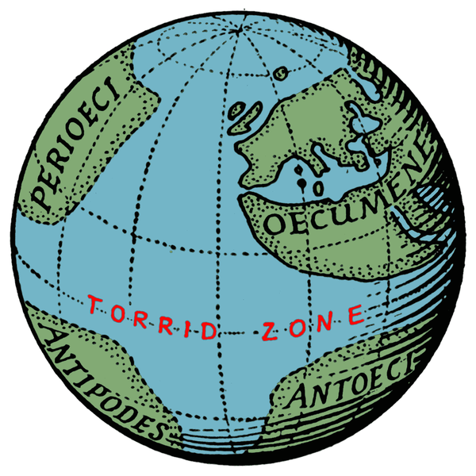{fig-alt="Globe de Cratès : quatre terres séparées par deux océans qui se croisent"}
:::
::: {.column width="58%"}
Vers 150 av. J.-C., Cratès de Mallos construit un globe.

Il n'y place pas seulement le monde connu. Par symétrie, il en imagine trois autres : les Périèques, les Antèques, les Antipodes.

[La carte devient un objet de réflexion : elle fait exister des terres que personne n'a vues.]{.a-retenir}
:::
::::

::: {.notes}
Suite à son élaboration, on envisage d'autres espaces. L'équilibre des terres
et l'harmonie de la sphère supposent l'existence d'espaces autres.
:::

## Une grille sur le monde {.socle}

:::: {.columns}
::: {.column width="34%"}
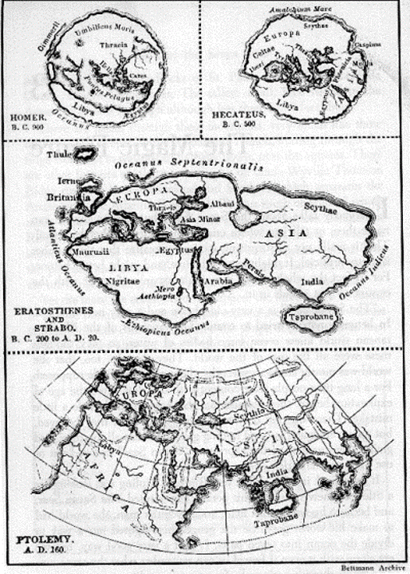{fig-alt="Quatre reconstitutions de cartes antiques, d'Homère à Ptolémée" height="450"}
:::
::: {.column width="66%"}
::: {.ordre}
En sept siècles, le monde connu s'élargit et se quadrille. Remettez ces quatre cartes dans l'ordre.

1. Un disque de terre entouré par le fleuve Océan
2. Trois continents autour de la Méditerranée
3. Les premières lignes de repère, parallèles et méridiens
4. Une grille complète de latitudes et de longitudes
:::

Avec Ptolémée, au II^e^ siècle, chaque lieu reçoit deux nombres. C'est aussi la première projection.
:::
::::

::: {.notes}
Homère, Hécatée, Ératosthène puis Ptolémée. Ératosthène et Ptolémée s'appuient
sur la vision sphérique de la Terre, d'où les longitudes et latitudes.
:::

## Où est le haut de la carte ? {.appui}

:::: {.columns}
::: {.column width="40%"}
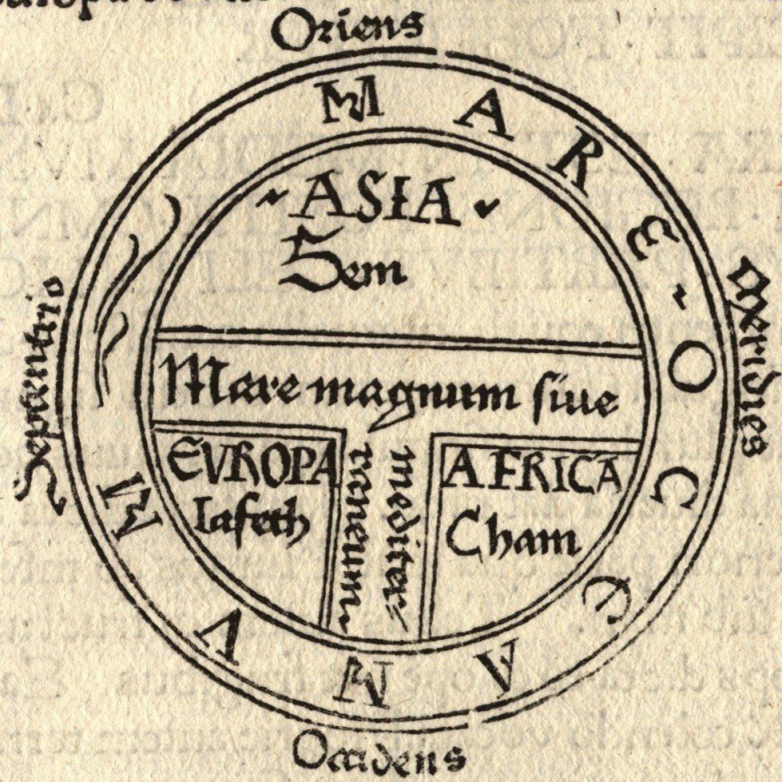{fig-alt="Carte en T dans l'O : l'Asie en haut, l'Europe et l'Afrique en bas, le mot Oriens au sommet"}
:::
::: {.column width="60%"}
::: {.question}
En haut de cette carte de 1472, on lit *Oriens*.

**D'où vient le verbe « orienter » ?**
:::

::: {.reponse}
Orienter une carte, c'était la tourner vers l'**Orient**, là où le Soleil se lève. Le nord en haut viendra bien plus tard.
:::
:::
::::

::: {.plus titre="La carte en T dans l'O"}
Le T est entouré d'un O qui représente l'océan, d'où le nom de carte TO : *Orbis Terrarum*.

Cette tripartition du monde correspond à la Trinité et au peuplement de la Terre par les trois fils de Noé : Sem pour l'Asie, Cham pour l'Afrique, Japhet pour l'Europe. Le T est assimilé au tau de la croix.

La carte en TO reprend le modèle circulaire d'Hécatée de Milet et d'Anaximandre. Jérusalem y remplace Delphes comme nombril du monde.

Ce type de représentation, lié à des croyances religieuses, perdure en Occident jusqu'au XII^e^ siècle. À la même époque, la superficie de l'Eurasie cartographiée par la civilisation chinoise est très largement supérieure.

La représentation TO est abandonnée peu à peu à partir du XII^e^ siècle. En 1154, à la cour du roi Roger II de Sicile, le géographe Al-Idrisi établit une mappemonde du monde connu qui ne l'adopte plus.
:::

::: {.notes}
Période de repli spatial, intérêt plus fort pour le monde spirituel. Exception du monde arabe.
:::

## Tournez la carte {.socle}

:::: {.columns}
::: {.column width="46%"}
::: {.pivoter image="images/al-idrisi.jpg" alt="Planisphère circulaire d'Al-Idrisi, copie de 1456" cible="180" tolerance="20"}
Le sud était en haut. Vous venez de remettre le nord à sa place habituelle : la Méditerranée, l'Arabie et le Nil se reconnaissent.
:::
:::
::: {.column width="54%"}
Planisphère d'Al-Idrisi, 1154, dans une copie de 1456.

Quelque chose vous échappe ? Faites tourner la carte, à la souris ou avec les flèches, jusqu'à reconnaître la Méditerranée.

[Le nord en haut n'est qu'une convention.]{.a-retenir}
:::
::::

## Regarder l'horizon {.intercalaire}

Deuxième regard : parcourir, mesurer, contrôler.

## Une carte sans géométrie {.appui}

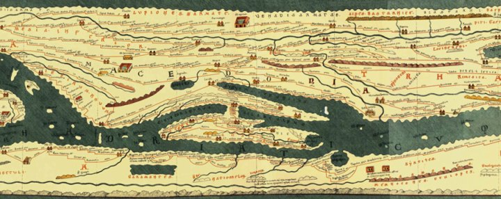{fig-alt="Extrait de la table de Peutinger : routes, étapes et villes étirées en un long ruban" height="200"}

:::: {.columns}
::: {.column width="50%"}
::: {.question}
La table de Peutinger déroule l'Empire romain sur près de 7 mètres de long, pour 34 centimètres de haut.

**Qu'est-ce qui est juste sur cette carte, qu'est-ce qui est faux ?**
:::
:::
::: {.column width="50%"}
::: {.reponse}
**Juste** : l'ordre des étapes, les liaisons, les distances écrites.
**Faux** : les formes, les directions, les proportions.

C'est un plan de métro avant l'heure.
:::
:::
::::

::: {.plus titre="Les routes de l'Empire romain"}
[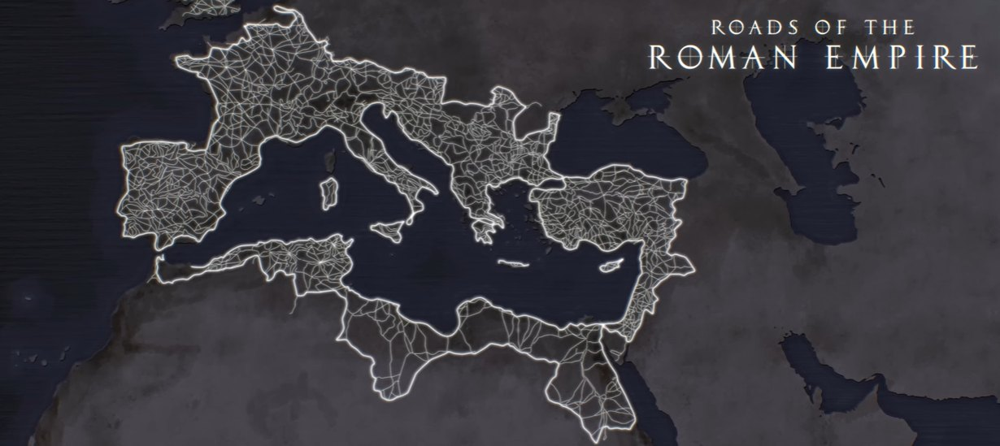{fig-alt="Carte du réseau des voies romaines autour de la Méditerranée"}](https://itiner-e.org/)

Le réseau des voies romaines, à explorer en ligne : [itiner-e.org](https://itiner-e.org/). Cliquez sur l'image.
:::

::: {.notes}
Copie médiévale d'une carte romaine. Faire le lien avec la topologie d'un réseau dans un SIG.
:::

## Suivre un cap

::: {.cap image="images/portulan-1540.jpg" alt="Portulan de 1540 : l'Europe et la Méditerranée couvertes de lignes de vents" x="44" y="57" depart="90"}
Sur un portulan, les lignes rayonnent des roses des vents. Le marin choisit celle qui mène au port, lit son cap, et le tient au compas.

Faites venir le navire sur la gauche ou sur la droite : un cran vaut un **quart**, soit 11,25°.
:::

::: {.notes}
Portulans : cartes de navigation, 1540. La carte devient un outil pour tenir une route.
:::

## Des instruments {.optionnel}

:::: {.columns}
::: {.column width="58%"}
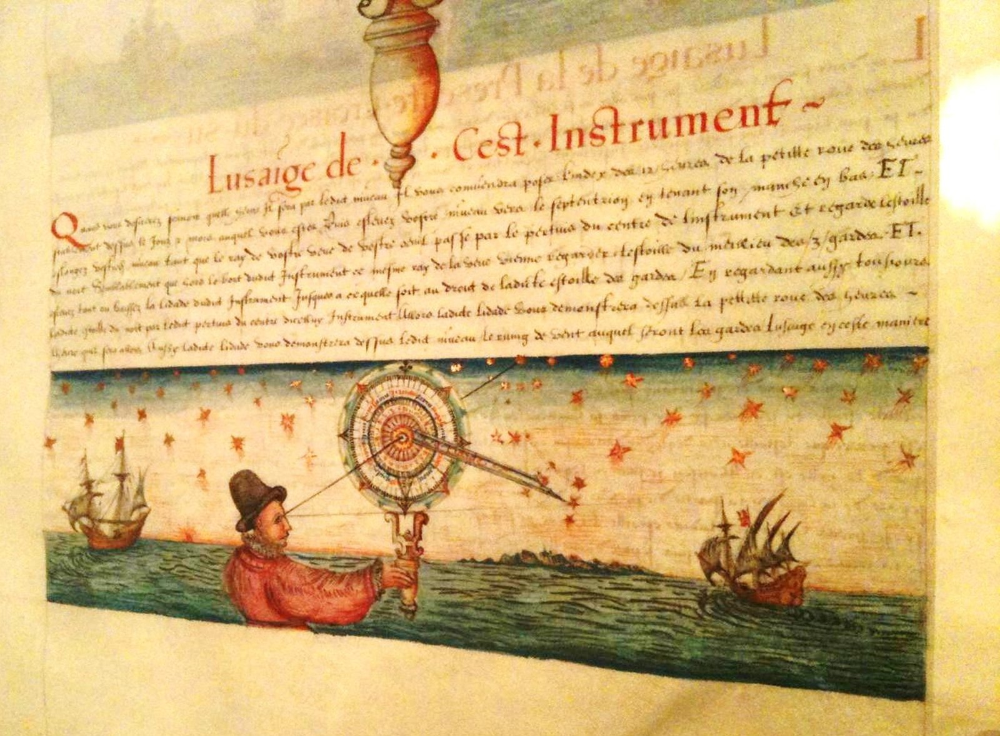{fig-alt="Manuscrit enluminé : un marin vise le ciel avec un instrument"}
:::
::: {.column width="42%"}
« L'usage de cet instrument… »

Viser un astre, lire un angle : avec l'alidade, la position se mesure au lieu de s'estimer.
:::
::::

## Mercator, pour garder le cap {.appui}

:::: {.columns}
::: {.column width="44%"}
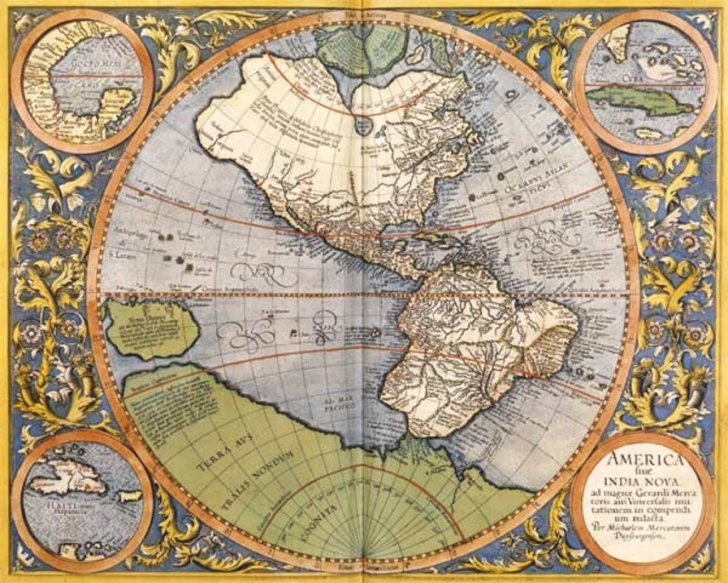{fig-alt="Carte de l'Amérique publiée dans l'atlas de Mercator en 1595"}

[Atlas de Mercator, 1595]{.legende}
:::
::: {.column width="56%"}
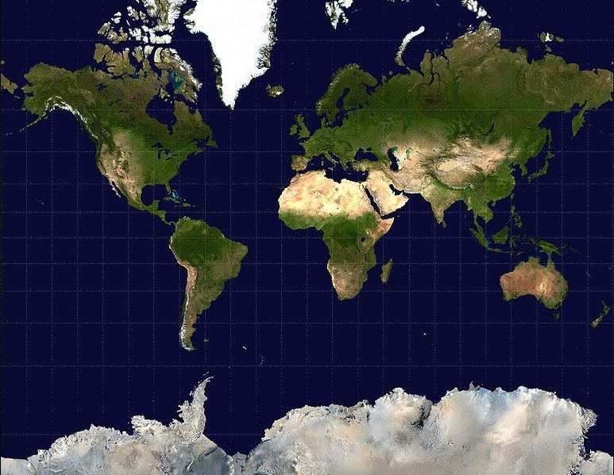{fig-alt="Planisphère en projection de Mercator" height="230"}

En 1569, Mercator invente une projection où une route à cap constant devient une **ligne droite**.

Elle conserve les angles. Le prix se paie sur les surfaces, on y revient.
:::
::::

::: {.plus titre="Une projection qui recule"}
Une projection abandonnée aussi bien à l'ONU : [document des Nations unies](https://documents.un.org/doc/undoc/ltd/n26/201/85/pdf/n2620185.pdf).

C'est un mouvement que la France, par le Quai d'Orsay, a engagé de son côté depuis 2021.
:::

::: {.notes}
La carte de 1595 montrée ici n'est pas en projection de Mercator : c'est un hémisphère de son atlas.
Le planisphère de droite, lui, l'est.
:::

## Mesurer un pays {.socle}

::: {.visees image="images/triangulation-greenwich-paris.jpg" alt="Plan des triangles reliant les observatoires de Greenwich et de Paris, 1784-1790" objectif="2" solution="1-2 1-3 1-4 2-3 2-4 3-4"}
Entre 1784 et 1790, Anglais et Français relient leurs observatoires par-dessus la Manche.

Reliez les stations deux à deux pour franchir la mer.

- Fairlight Down : 40.0,74.6
- Douvres : 59.5,52.1
- Cap Blanc-Nez : 70.7,70.3
- Montlambert : 69.4,90.0
- Calais : 75.2,67.1

**La mer est franchie.** On ne mesure qu'une seule longueur, la base. Tout le reste se déduit des angles, de triangle en triangle.
:::

::: {.notes}
La triangulation : couvrir un territoire de triangles à partir d'une base mesurée.
Les visées au-dessus de la Manche dépassent 40 km ; on observe de nuit, sur des feux.
:::

## La carte de Cassini {.appui}

:::: {.columns}
::: {.column width="58%"}
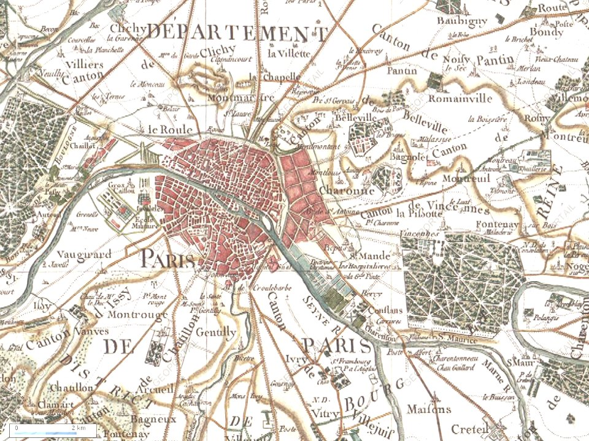{fig-alt="Paris et ses environs sur la carte de Cassini, vers 1780"}
:::
::: {.column width="42%"}
Au XVIII^e^ siècle, quatre générations de Cassini couvrent le royaume de triangles.

[La première carte d'un pays entier levée par triangulation.]{.a-retenir}

Elle servira de modèle à toute l'Europe.
:::
::::

## La carte, outil de pouvoir {.veille}

::: {.mosaique}
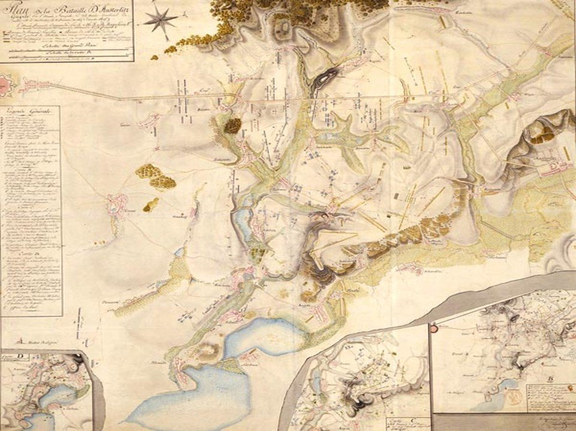{fig-alt="Plan de la bataille d'Austerlitz, 2 décembre 1805"}

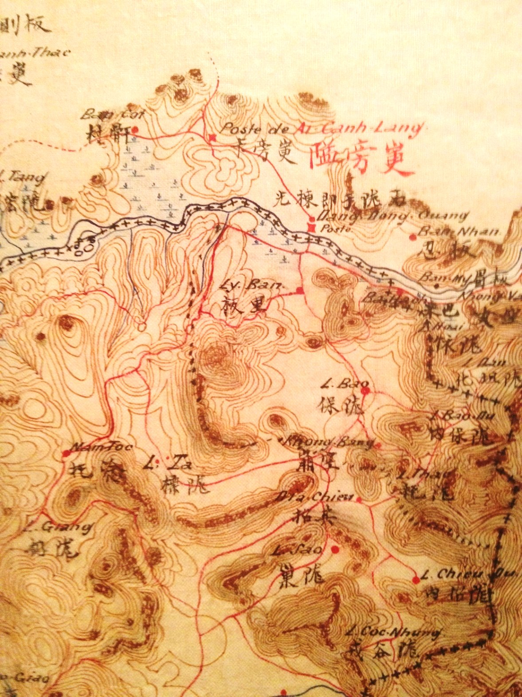{fig-alt="Carte de la frontière chinoise de l'Indochine"}

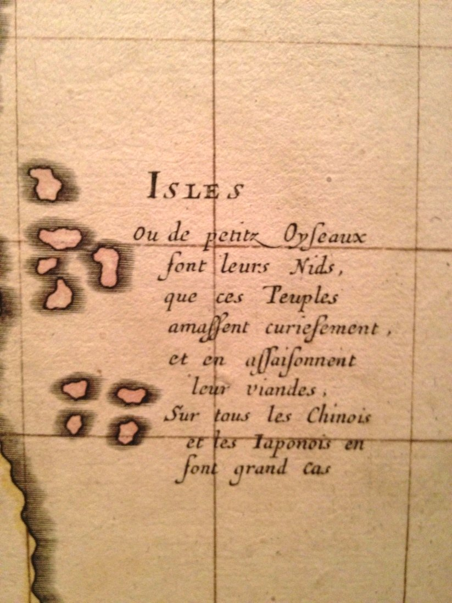{fig-alt="Détail d'une carte ancienne : des îles et une légende manuscrite sur les nids d'oiseaux"}
:::

:::: {.columns}
::: {.column width="50%"}
::: {.question}
Austerlitz, 1805. La frontière de l'Indochine. Des îles et leur légende.

**Que dit la légende des îles sur celui qui dessine ?**
:::
:::
::: {.column width="50%"}
::: {.reponse}
Elle note ce qui a de la valeur pour lui : ici, des nids que l'on vend cher. Cartographier, c'est déjà inventorier, donc contrôler.
:::
:::
::::

::: {.notes}
La carte devient précise. Assez pour mettre en place non plus des stratégies, mais des tactiques.
C'est un outil de conquête de nouveaux territoires, de contrôle des anciens.
Elle se démarque aussi par la perspective plongeante : l'observateur domine et observe.
:::

## Sur le terrain {.optionnel}

::: {.mosaique}
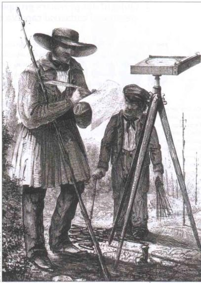{fig-alt="Gravure : deux géomètres et leur planchette"}

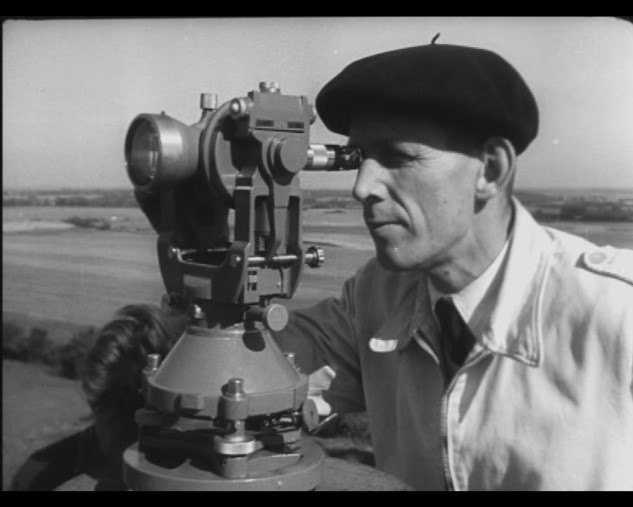{fig-alt="Un géodésien vise dans un théodolite"}

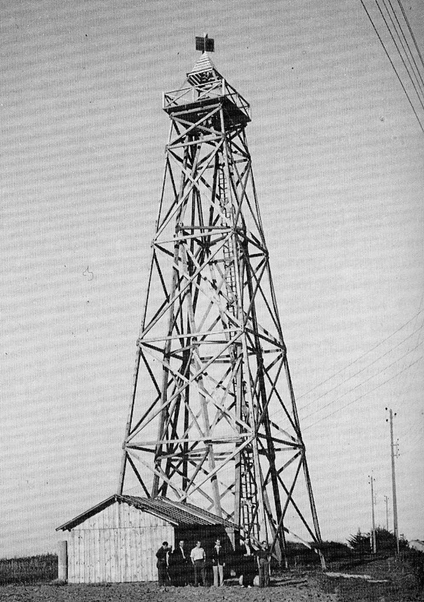{fig-alt="Tour géodésique en charpente métallique"}

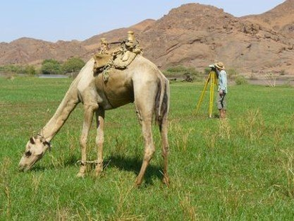{fig-alt="Un topographe au travail dans une plaine, un dromadaire au premier plan"}
:::

La planchette pour dessiner sur place, le théodolite pour mesurer les angles, la tour pour voir plus loin : le métier ne change que par ses instruments.

## Nancy, trois siècles {.appui}

:::: {.columns}
::: {.column width="62%"}
::: {.comparer}
- 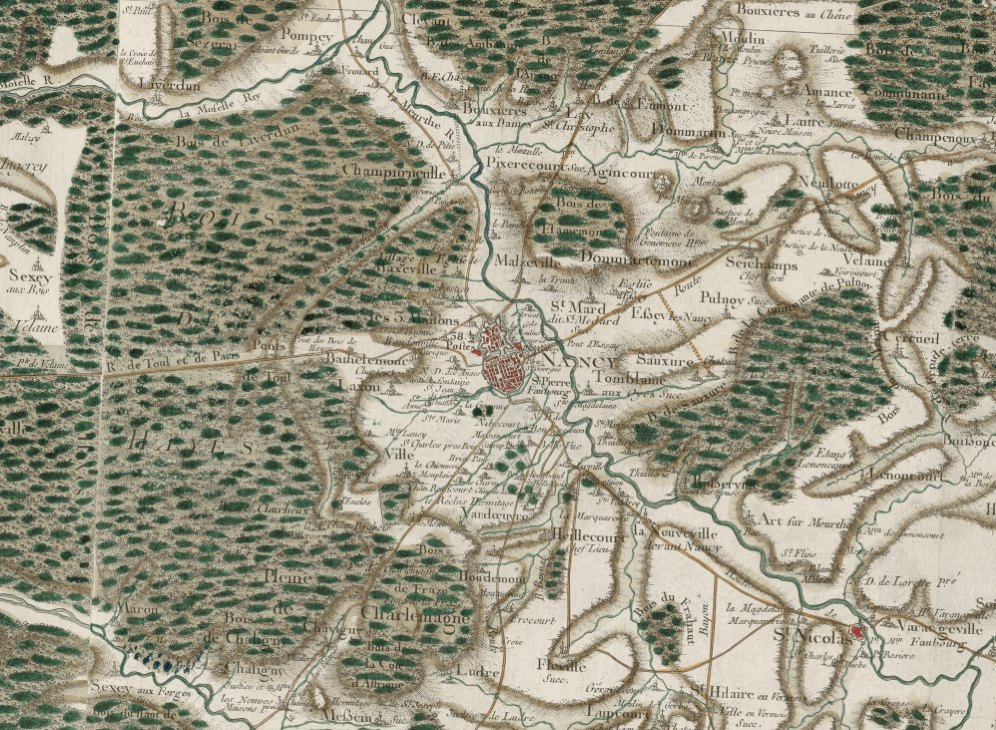
- 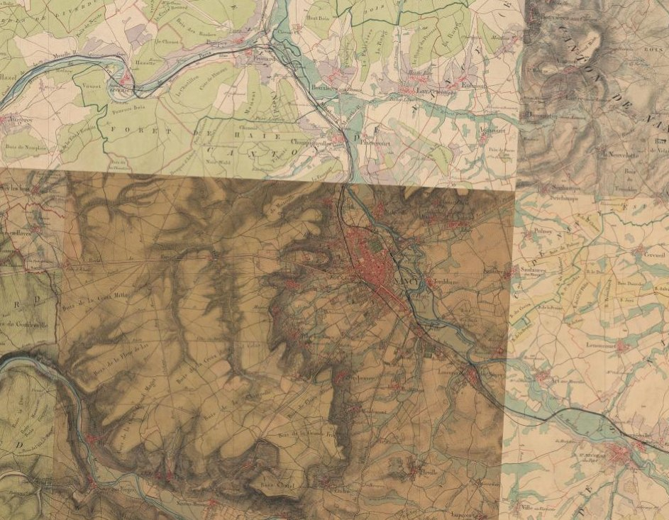
- 
:::
:::
::: {.column width="38%"}
Le même lieu, trois cartes.

Déplacez le curseur. **Que devient la forêt ?** Et la ville ?

La carte ancienne n'est pas une image du passé : c'est une donnée que l'on peut comparer.
:::
::::

::: {.notes}
Les trois extraits ne sont pas parfaitement calés : pour un rendu propre,
réexporter les trois couches depuis un SIG sur la même emprise.
:::

## Regarder d'en haut {.intercalaire}

Troisième regard : il se retourne, et se centre sur la Terre.

## Prendre de la hauteur {.appui}

:::: {.columns}
::: {.column width="56%"}
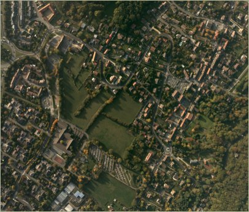{fig-alt="Photographie aérienne d'un bourg et de ses abords boisés"}
:::
::: {.column width="44%"}
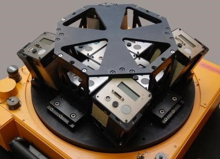{fig-alt="Caméra aérienne numérique à plusieurs objectifs" height="200"}

Avec l'avion, on ne lève plus le terrain point par point : on le photographie, puis on mesure sur l'image.

[La carte se dessine désormais d'après une image.]{.a-retenir}
:::
::::

## Le satellite {.appui}

:::: {.columns}
::: {.column width="56%"}
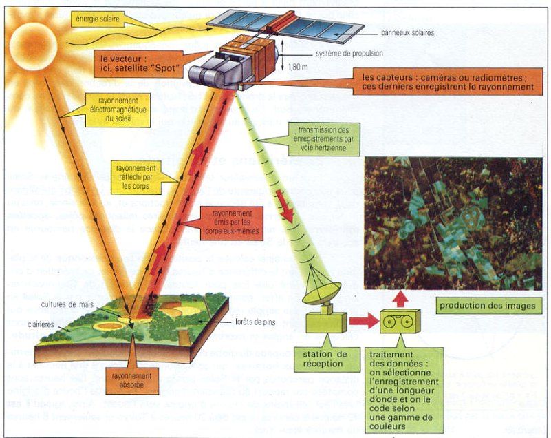{fig-alt="Schéma d'acquisition d'une image par le satellite SPOT, du Soleil à la station de réception"}
:::
::: {.column width="44%"}
Le Soleil éclaire, la surface renvoie, le capteur enregistre, la station reçoit.

Depuis SPOT 1, en 1986, la même zone peut être revue tous les quelques jours.

Ce schéma est le point de départ du cours de télédétection.
:::
::::

## Une forêt vue de l'espace

:::: {.columns}
::: {.column width="60%"}
::: {.zones image="images/egmont-depuis-orbite.jpg" alt="Le mont Egmont et sa forêt en disque sombre, vus depuis l'orbite"}
- [x] 43,35,20,21 : La limite du parc est un cercle presque parfait, à une dizaine de kilomètres du sommet.
- [ ] 62,22,14,45 : Ici, c'est le trait de côte : une limite naturelle.
- [ ] 8,45,30,35 : Des pâturages. La forêt a été défrichée jusqu'à la limite, pas au-delà.
:::
:::
::: {.column width="40%"}
Parc national d'Egmont, Nouvelle-Zélande.

**Où passe la limite de la forêt ?**

::: {.reponse etiquette="Qu'est-ce que cela dit du monde ?"}
Cette limite a d'abord été tracée au compas, sur une carte. La carte ne décrit pas seulement le territoire : elle le fabrique.
:::
:::
::::

## Nancy, aujourd'hui

:::: {.columns}
::: {.column width="62%"}
::: {.comparer}
- 
- 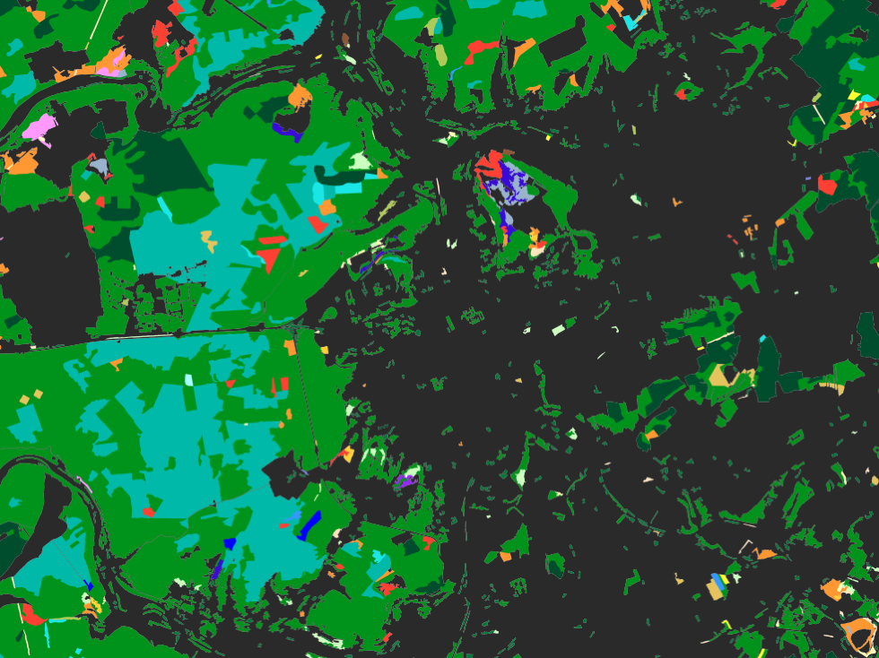
- 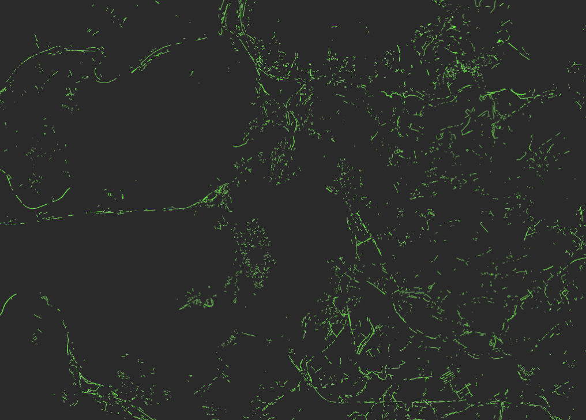
:::
:::
::: {.column width="38%"}
La forêt et les haies ne sont plus seulement dessinées : elles sont **décrites**, objet par objet.

Chaque tache de couleur porte un type de peuplement, une surface, une date.

C'est la matière première d'un SIG.
:::
::::

## Les trois regards {.socle}

::: {.schema fichier="images/schemas/trois-regards.svg" hauteur="170"}
:::

::: {.classer}
### Lever les yeux

- Tablette de Babylone
- Carte en T dans l'O

### Regarder l'horizon

- Portulan
- Carte de Cassini

### Regarder d'en haut

- Photographie aérienne
- BD Forêt
:::

::: {.notes}
Le regard tourné vers les étoiles s'est abaissé, puis s'est centré sur le monde.
Rapport centrifuge, puis tangentiel, puis centripète.
:::

## De quelle forme parle-t-on ? {.intercalaire}

La montée : chaque forme corrige la précédente.

::: {.schema fichier="images/schemas/escalier-montee.svg"}
:::

## Le plan suffit… jusqu'où ? {.appui}

:::: {.columns}
::: {.column width="50%"}
::: {.schema fichier="images/schemas/plan-sphere.svg"}
:::
:::
::: {.column width="50%"}
::: {.question etiquette="Prédiction"}
Vous levez une parcelle comme si la Terre était plate.

**À quelle distance l'erreur dépasse-t-elle un mètre ?**
:::

::: {.reponse}
| Distance | Écart au plan |
|---------:|--------------:|
| 1 km     | 8 cm          |
| 10 km    | 8 m           |

Entre 3 et 4 km : assez pour une parcelle, pas pour un massif.
:::
:::
::::

## La sphère {.socle}

:::: {.columns}
::: {.column width="40%"}
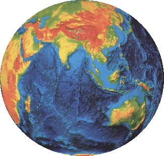{fig-alt="Globe terrestre en relief"}
:::
::: {.column width="60%"}
Un centre, un rayon : le premier modèle de la Terre entière.

- Rayon moyen : **6 371 km**.
- Tour de la Terre : environ **40 000 km**.

La sphère suffit pour raisonner, pour une carte du monde, pour un calcul rapide. Elle ne suffit pas pour mesurer.
:::
::::

## L'ellipsoïde {.socle}

:::: {.columns}
::: {.column width="54%"}
::: {.qcm}
Au XVIII^e^ siècle, deux camps s'opposent sur la forme de la Terre.

- [ ] Allongée vers les pôles, comme un citron
    - C'est ce que défendent les Cassini, d'après leurs mesures en France.
- [x] Aplatie aux pôles, comme une mandarine
    - Newton a raison : la rotation renfle l'équateur.
:::
:::
::: {.column width="46%"}
Pour trancher, on mesure un degré de méridien en **Laponie** et au **Pérou**.

[La Terre est aplatie aux pôles : 21 km d'écart entre les deux rayons.]{.a-retenir}

L'ellipsoïde est une forme mathématique simple : deux nombres le définissent.
:::
::::

::: {.notes}
Maupertuis en Laponie, La Condamine au Pérou. Kepler s'intéresse au mouvement des planètes ;
on mesure des trajectoires en ellipse, puis on pense la Terre elle-même comme un ellipsoïde.
:::

## Le géoïde {.socle}

:::: {.columns}
::: {.column width="46%"}
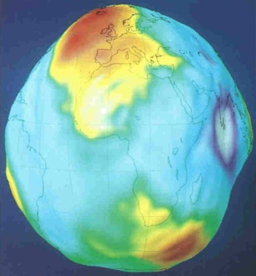{fig-alt="Le géoïde, aux ondulations très exagérées, coloré selon son écart à l'ellipsoïde" height="380"}
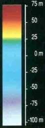{fig-alt="Échelle de couleur de −100 m à +75 m" height="250"}
:::
::: {.column width="54%"}
L'eau coule vers le bas, et le bas dépend de la **gravité**, qui n'est pas la même partout.

On prolonge sous les continents le niveau moyen des mers : cette surface est le **géoïde**.

[L'altitude se mesure à partir du géoïde.]{.a-retenir}

En France, l'origine est le marégraphe de Marseille.
:::
::::

::: {.notes}
Ce serait la forme de la Terre s'il n'y avait qu'un immense océan.
Causes des ondulations : masses internes, épaisseur de la croûte, attraction des astres.
:::

## Hauteur n'est pas altitude {.socle}

:::: {.columns}
::: {.column width="52%"}
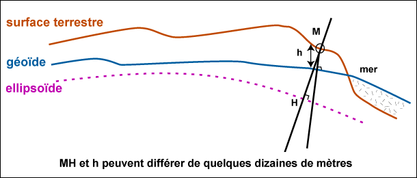{fig-alt="Profil montrant la surface terrestre, le géoïde et l'ellipsoïde au droit d'un point M"}
:::
::: {.column width="48%"}
::: {.qcm}
Sur ce profil, que mesure la double flèche, entre le point M et la ligne bleue ?

- [x] L'altitude de M
    - Oui : elle se compte depuis le géoïde.
- [ ] La hauteur de M au-dessus de l'ellipsoïde
    - Non : celle-ci descend jusqu'à la ligne en pointillés.
- [ ] La profondeur de la mer
    - Non, la mer est plus à droite.
:::
:::
::::

Un GPS donne une hauteur au-dessus de l'ellipsoïde. Pour obtenir une altitude, il faut lui retirer l'ondulation du géoïde.

## Des écarts sans commune mesure {.appui}

:::: {.columns}
::: {.column width="56%"}
::: {.curseur min="1" max="8000" pas="1" valeur="1" unite="fois" etiquette="Hauteurs exagérées" schema="images/schemas/geoide-exagere.svg"}
- 100 m de géoïde occupent `{0.0056*x|2}` pixel sur ce dessin
:::
:::
::: {.column width="44%"}
| D'une forme à l'autre | Écart |
|---|--:|
| Sphère → ellipsoïde | 21 km |
| Ellipsoïde → géoïde | ± 100 m |

Poussez le curseur : sans exagération, le géoïde ne se distingue pas de l'ellipsoïde.

Chaque marche corrige deux cents fois moins que la précédente.
:::
::::

## Positionner un point M {.intercalaire}

La descente : du géoïde aux coordonnées sur la carte.

::: {.schema fichier="images/schemas/escalier-descente.svg"}
:::

## Dans quel ordre ? {.socle}

::: {.ordre}
Du monde réel aux coordonnées que l'on lit dans un SIG : remettez la chaîne dans l'ordre.

1. La Terre réelle
2. Le géoïde
3. L'ellipsoïde
4. Le système géodésique
5. La projection
6. Les coordonnées planes
:::

## Repérer M sur l'ellipsoïde {.socle}

:::: {.columns}
::: {.column width="46%"}
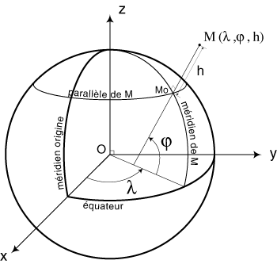{fig-alt="Un point M repéré par sa longitude, sa latitude et sa hauteur sur l'ellipsoïde"}
:::
::: {.column width="54%"}
Sur l'ellipsoïde, trois nombres suffisent :

- la **longitude λ**, depuis un méridien d'origine ;
- la **latitude φ**, depuis l'équateur ;
- la **hauteur** au-dessus de l'ellipsoïde.

Ce sont les **coordonnées géographiques**. Elles s'expriment en degrés, pas en mètres.
:::
::::

## Le système géodésique {.socle}

:::: {.columns}
::: {.column width="52%"}
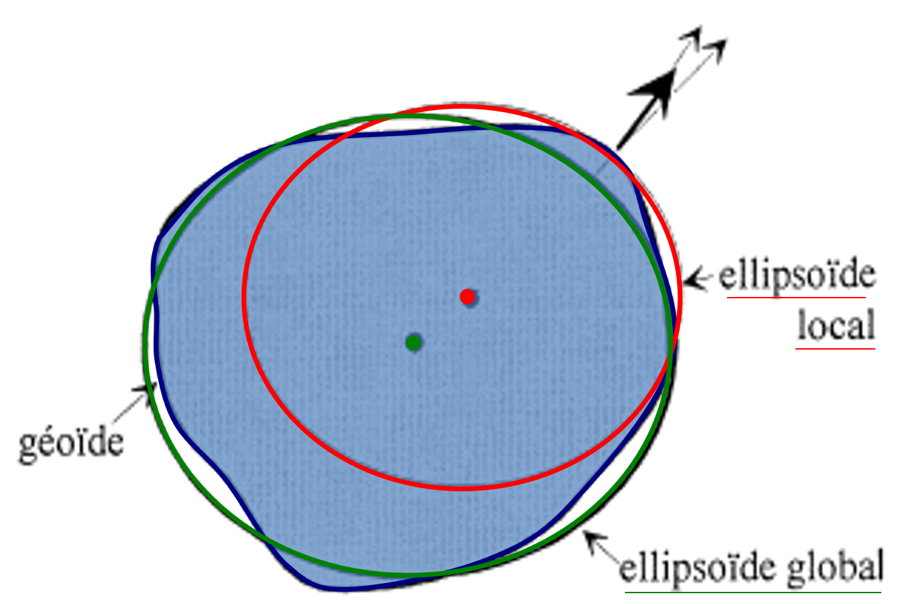{fig-alt="Un ellipsoïde local, ajusté à un pays, et un ellipsoïde global, ajusté à toute la Terre"}
:::
::: {.column width="48%"}
Un ellipsoïde ne suffit pas : il faut le **poser** et l'**orienter** par rapport à la Terre.

- Hier, chaque pays ajustait le sien à son territoire : systèmes **locaux**.
- Les satellites ont permis un ajustement à la Terre entière : systèmes **mondiaux**.

[Des coordonnées sans leur système ne désignent aucun lieu.]{.a-retenir}
:::
::::

## Quel système en France ? {.socle}

:::: {.columns}
::: {.column width="52%"}
::: {.qcm}
Lequel est le système légal en France métropolitaine ?

- [ ] NTF
    - C'était le cas jusqu'en 2000. Système local, issu d'une triangulation.
- [ ] ED50
    - Système européen, local lui aussi.
- [x] RGF93
    - Oui. Système spatial, légal depuis le décret de 2000.
- [ ] WGS84
    - C'est le système du GPS. Très proche du RGF93, mais ce n'est pas le système légal.
:::
:::
::: {.column width="48%"}
::: {.reponse etiquette="À retenir"}
| Système | Local | Spatial |
|---------|:-----:|:-------:|
| NTF     | ✓     |         |
| ED50    | ✓     |         |
| RGF93   |       | ✓       |
| WGS84   |       | ✓       |
:::
:::
::::

## Projeter, c'est choisir {.socle}

:::: {.columns}
::: {.column width="54%"}
### Conforme
Conserve localement les **angles** et les formes. Géodésie, topographie, navigation.

### Équivalente
Conserve les **surfaces**. Cartographie thématique, calcul de superficies.

### Aphylactique
Ne conserve ni l'un ni l'autre : un compromis.
:::
::: {.column width="46%"}
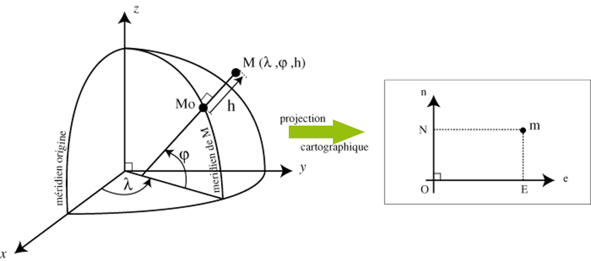{fig-alt="Passage des coordonnées géographiques aux coordonnées planes"}

[Aucune projection ne conserve à la fois les angles, les surfaces et les distances.]{.a-retenir}
:::
::::

## Où Mercator exagère-t-elle ? {.appui}

:::: {.columns}
::: {.column width="62%"}
::: {.zones image="images/proj-mercator.jpg" alt="Planisphère en projection de Mercator"}
- [x] 30,0,16,22 : Le Groenland paraît aussi grand que l'Afrique. Il est en réalité 14 fois plus petit.
- [x] 0,80,100,20 : L'Antarctique s'étire sur toute la largeur de la carte. Plus on approche des pôles, plus les surfaces enflent.
- [ ] 45,33,17,30 : L'Afrique est à cheval sur l'équateur : c'est là que les surfaces sont les plus justes.
- [ ] 27,44,14,34 : L'Amérique du Sud est peu déformée, sauf à sa pointe.
:::
:::
::: {.column width="38%"}
La projection de Mercator est **conforme**. Le prix à payer se lit sur les surfaces.

::: {.reponse etiquette="Comparer"}
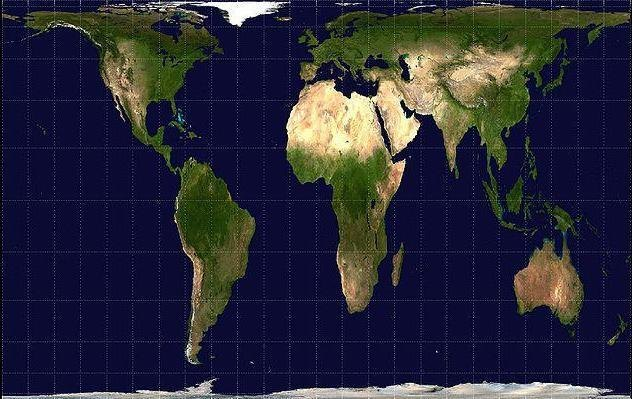{fig-alt="Planisphère en projection de Peters, équivalente" height="150"}

[Projection de Peters, équivalente]{.legende}
:::
:::
::::

## Trois familles de canevas {.appui .optionnel}

:::: {.columns}
::: {.column width="33%"}
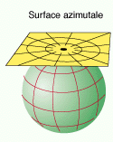{fig-alt="Plan tangent à la sphère" height="230"}

### Azimutal
Un plan tangent à l'ellipsoïde.
:::
::: {.column width="33%"}
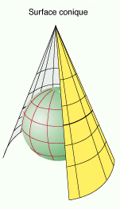{fig-alt="Cône posé sur la sphère" height="230"}

### Conique
Un cône tangent ou sécant. *Ex. : Lambert.*
:::
::: {.column width="33%"}
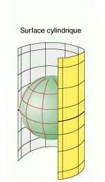{fig-alt="Cylindre entourant la sphère" height="230"}

### Cylindrique
Un cylindre tangent ou sécant. *Ex. : UTM.*
:::
::::

## La France en zones {.veille .optionnel}

:::: {.columns}
::: {.column width="58%"}
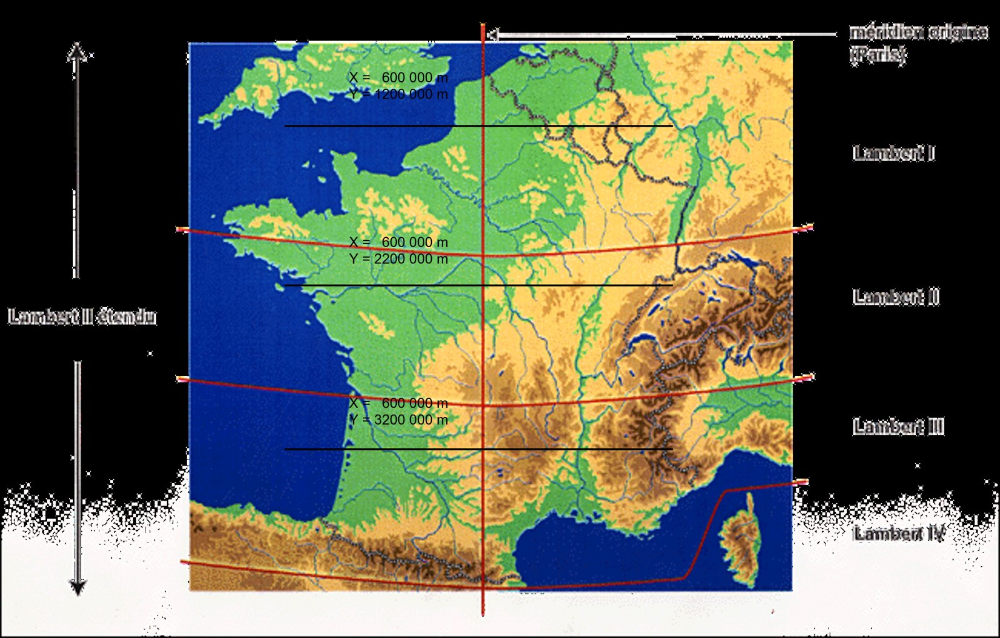{fig-alt="Les quatre anciennes zones Lambert sur la carte de France"}
:::
::: {.column width="42%"}
Jusqu'en 2000, la France est découpée en quatre zones Lambert, du nord à la Corse.

Pourquoi découper ? Plus on s'éloigne du parallèle de contact, plus les longueurs sont altérées.

Vous croiserez encore ces coordonnées dans des données anciennes.
:::
::::

## Les neuf coniques conformes {.veille .optionnel}

Le Lambert 93 altère trop les longueurs pour certains travaux de géomètre.

Neuf projections **CC42 à CC50** le complètent : une zone de 2° de latitude chacune, centrée sur un parallèle de degré entier, avec une altération inférieure à 9 cm par kilomètre.

## Lambert 93 {.socle}

:::: {.columns}
::: {.column width="44%"}
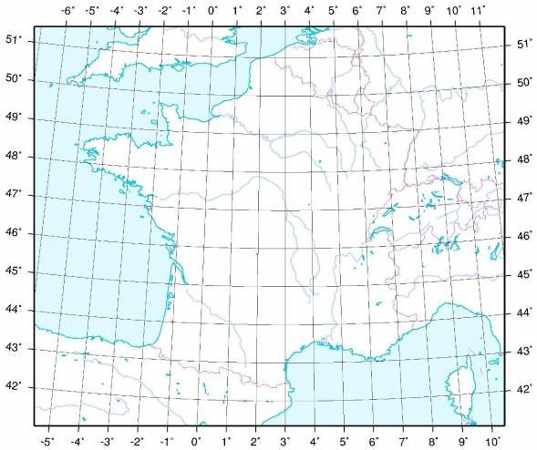{fig-alt="La France dans le quadrillage Lambert 93"}
:::
::: {.column width="56%"}
| Paramètre | Valeur |
|-----------|--------|
| Système géodésique | RGF93 |
| Ellipsoïde | IAG-GRS 1980 |
| Projection | conique conforme |
| Origine | 46°30′ N, 3° E |
| Parallèles d'échelle conservée | 44° N et 49° N |

La référence aujourd'hui, pour toute la métropole. Dans un SIG, c'est le code **`EPSG:2154`**.
:::
::::

## Un point, trois écritures {.appui .optionnel}

Le même point M, place Stanislas à Nancy :

| Écriture | Coordonnées | Système |
|---|---|---|
| Géographiques | 48°41′37″ N, 6°11′00″ E | RGF93 |
| Lambert 93 | E = 934 230 m, N = 6 848 439 m | `EPSG:2154` |
| UTM, fuseau 32 | E = 292 722 m, N = 5 397 225 m | `EPSG:32632` |

[Le lieu ne change pas. Seule change la façon de l'écrire.]{.a-retenir}

Superposer des couches qui n'ont pas la même écriture, sans le dire au logiciel, est l'erreur la plus fréquente en SIG.

## À retenir

::: {.carte-du-cours niveaux="socle"}
:::

## À vous {.fin}

Ouvrez QGIS et vérifiez le système de coordonnées de votre projet.

## Sources et crédits {.petit}

:::: {.columns}
::: {.column width="50%"}
| Document | Origine |
|---|---|
| Mary Cassatt, *La Leçon*, 1890 | photographie M. Poupée |
| Gravure rupestre de Bedolina | à compléter |
| Tablette babylonienne, VII^e^ s. av. J.-C. | British Museum |
| Cosmogonie perse | L. Haddad, G. Duprat, *Mondes, mythes et images de l'univers* |
| Le monde selon Hécatée | publié par John Murray |
| Globe de Cratès | à compléter |
| Cartes antiques | à compléter |
| Carte en T dans l'O, 1472 | à compléter |
| Planisphère d'Al-Idrisi, copie de 1456 | à compléter |
| Table de Peutinger | à compléter |
| Voies romaines | itiner-e.org |
| Portulan, 1540 | à compléter |
:::
::: {.column width="50%"}
| Document | Origine |
|---|---|
| Atlas de Mercator, 1595 | à compléter |
| Triangulation Greenwich – Paris, 1784-1790 | à compléter |
| Carte de Cassini | à compléter |
| Austerlitz, Indochine | à compléter |
| Instruments et terrain | à compléter |
| Nancy : Cassini, état-major, 1:25 000 | à compléter |
| Nancy : BD Forêt, haies | à compléter |
| Photographie aérienne, caméra | à compléter |
| Schéma d'acquisition SPOT | à compléter |
| Mont Egmont depuis l'orbite | à compléter |
| Géoïde, ellipsoïdes, projections | anciens supports de cours |
| Schémas dessinés | réalisés pour ce cours |
:::
::::
