::: {.fiche n="0.1" etat="a-revoir"}
Intention : Cover, on the map of Peenemünde, at the heart of Marc's serious game. [V0 feedback: the Peenemünde map as title image.]
Experience : none
Request :
:::

## How to use this handout

::: {.fiche n="0.2" etat="a-revoir"}
Intention : The shared user guide, plus what is specific to this course: the investigation, writing before the answer, the certainty bar, the revision mode. AI transparency statement. [new]
Experience : none
Request :
:::

This course is an **investigation**. Almost every slide asks you to look, write or choose **before** reading the answer.

- The **icon** in front of each title gives the level: **core**, to master; **support**, to consolidate; **further**, to go beyond. A slide without an icon is an example.
- The **writing boxes** keep what you write, in your browser only: you will find it again later on.
- The **certainty bar** asks you, before answering, how sure you are. At the end, the course compares your certainty with your results.
- The last part holds a **revision mode**, to reopen in a day, a week, a month.

::: {.transparence-ia profil="✒️ The equipped Author" coordonnees="F2 · R0 · S0" outil="Claude 5"}
:::

## What you will be able to do

::: {.fiche n="0.3" etat="a-revoir"}
Intention : The six skills, each with an action verb; a starting self-assessment, taken up again at the end. [new]
Experience : starting self-assessment: I don't know / I think I know / I know ("bilan" brick)
Request :
:::

Place yourself before you start. The same grid comes back at the end.

::: {.bilan moment="debut"}
- C1 | Describe before interpreting: separate what I see from what I infer
- C2 | Identify an object with the identification keys: tone, size, shape, texture, pattern, shadow, date
- C3 | Reconstruct a mechanism by cross-checking clues, and state my degree of certainty
- C4 | Choose the image that answers a question, and know its limits
- C5 | Turn an interpretation into data: nomenclature, minimum mapping unit, checks
- C6 | Tell a real image from a generated one, and place the interpreter alongside AI
:::

## Course map

::: {.fiche n="0.4" etat="a-revoir"}
Intention : The seven parts and the key to the three levels. [V0 feedback: the core list ran off the slide; a level with more than 16 slides now spreads over two columns, in every course.]
Experience : links to each slide
Request :
:::

::: {.carte-du-cours}
:::

## Seeing, then knowing {.intercalaire}

::: {.fiche n="1.0" etat="a-revoir"}
Intention : The intelligence of an image: one word, two meanings, gathering information and understanding. [new]
Experience : none
Request :
:::

*Intelligence*: gathering information, and understanding. This course is about both.

## The scene {competences="C1"}

::: {.fiche n="1.1" etat="a-revoir"}
Intention : The opening with the scene from the series "Cœurs noirs" (Prime Video, 2023), shown in class: a secret base is detected on an image. The handout holds no excerpt or still; only the reference and two writing boxes. Episode and timecode to be given by Marc. Example, no level. [V0 feedback: a video sequence gives the correction in class; no more comparison with an expert reading.]
Experience : two writing boxes: what did we see? what did we infer, and how sure? ("observer" brick, no expert reading); the correction is the video sequence
Request :
:::

The scene is shown in class: the series *Cœurs noirs*, season 1 (Prime Video, 2023), episode and timecode to be added. A team spots a secret base on an image. The correction follows, on video.

:::: {.columns}
::: {.column width="50%"}
**What did we see on the image?**

::: {.observer cle="scene-vu" invite="Shapes, colours, objects…"}
:::
:::
::: {.column width="50%"}
**What did we infer, and how sure were we?**

::: {.observer cle="scene-deduit" invite="A hypothesis, and what supports it…"}
:::
:::
::::

## What we see, what we infer {.socle competences="C1"}

::: {.fiche n="1.2" etat="a-revoir"}
Intention : The founding distinction: observation (what is on the image) and inference (what we conclude from it). On the course image, without saying what it is: it will be discovered later, key after key. Link with graphic and mental understanding in "Cartography: Basics". [V0 feedback: the statements gave the answer away ("a nuclear power plant") and killed the deduction; the new ones do not say what the site is.]
Experience : sort six statements into "I see" or "I infer"
Request :
:::

:::: {.columns}
::: {.column width="42%"}
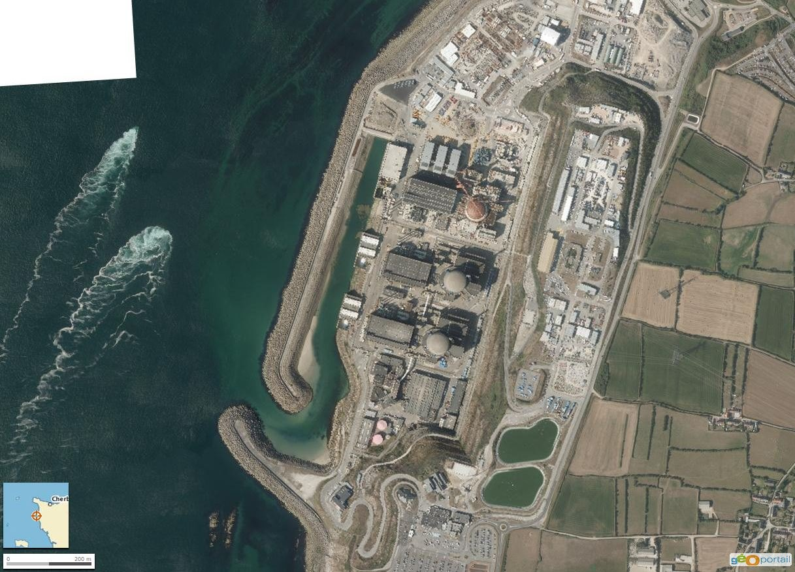{height="360" fig-alt="Orthophoto of an industrial site by the sea"}
:::
::: {.column width="58%"}
Sort each statement: is it **on** the image, or **drawn from** the image?

::: {.classer}
### I see

- Two grey discs
- White patches offshore
- Long thin shapes around a disc

### I infer

- They are domes
- The water is rough offshore
- Construction is under way
:::

[Seeing is describing. Inferring is already interpreting: it needs evidence.]{.a-retenir}
:::
::::

## Induction, deduction, abduction {.socle competences="C3"}

::: {.fiche n="1.3" etat="a-revoir"}
Intention : The cognitive process of the investigation. Marc's definitions: induction draws a rule from repeated facts (highly probable, never absolutely certain); deduction draws a conclusion from rules or premises (certain if they are true); abduction puts forward hypotheses to explain an observed fact (no certainty, leads, above all when the fact surprises). Sherlock Holmes's "deduction" is mostly abduction. [V0 feedback: Marc's definitions; the examples leave the boxes and form the bundle of clues, instead of shape / site / association / time; the multiple choice, which could be answered by reading, becomes a sort of three short reasonings on one example.]
Experience : diagram; sort three reasonings on one example
Request :
:::

:::: {.columns}
::: {.column width="60%"}
::: {.schema fichier="images/schemas/en/raisonnements.svg" hauteur="440"}
:::
:::
::: {.column width="40%"}
Three reasonings about one field. Which is which?

::: {.classer}
### Induction

- The hundred rapeseed fields seen in April were yellow: rapeseed flowers in April.

### Deduction

- Rapeseed flowers in April; the image is from April: its rapeseed fields are yellow.

### Abduction

- A bright yellow field in spring: perhaps rapeseed in flower.
:::
:::
::::

## A trade born of war {.appui competences="C1"}

::: {.fiche n="1.4" etat="a-revoir"}
Intention : The beginnings: aerial photography born of balloons, kites and pigeons, booming in 1914-1918, intelligence in 1939-1945 (Constance Babington Smith spots the V-1 on a Peenemünde photograph, 1943), Cold War spy satellites (Corona). Students open a "top secret" file showing Marc's timeline full screen, then put the steps in order. Bonus: the alternate-history series "Star City" and the tour of the aerial photography museum. [V0 feedback: to answer, students need data: Marc's timeline, in a file that opens full screen; link with "Star City". The timeline is in French.]
Experience : open the file ("dossier" brick); put six steps in order; bonus: Star City, virtual tour (scroll)
Request :
:::

:::: {.columns}
::: {.column width="30%"}
A file has just arrived. Open it, then put the story in order.

::: {.dossier titre="Intelligence from the sky, 1858-2020"}
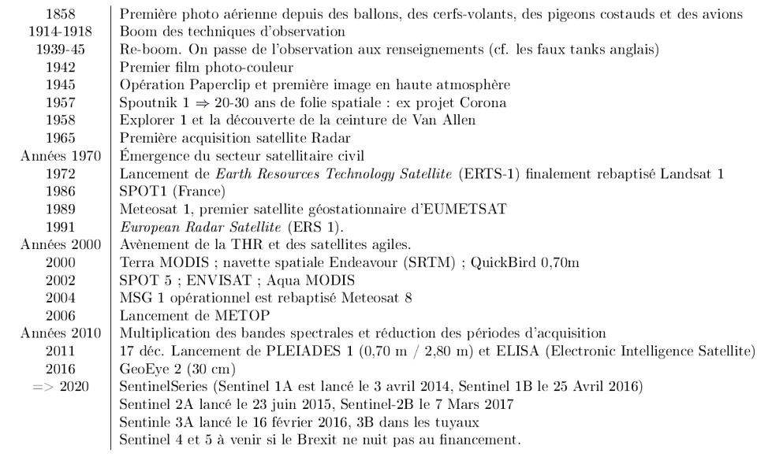{fig-alt="Timeline of aerial and satellite photography, from 1858 to 2020 (in French)"}
:::
:::
::: {.column width="70%"}
::: {.ordre}
1. First aerial photograph, from a balloon
2. Aerial observation booms (1914-1918)
3. Intelligence: Peenemünde, dummy tanks
4. Sputnik, then the Corona spy satellites
5. Landsat 1, the first civilian satellite
6. Pléiades: 70 cm images
:::
:::
::::

::: {.plus titre="Going further"}
**Another series, alternate history: *Star City*.** The Soviet space programme, a spin-off of the alternate history *For All Mankind* (Apple TV+, 2026): images seen from space are interpreted there too.

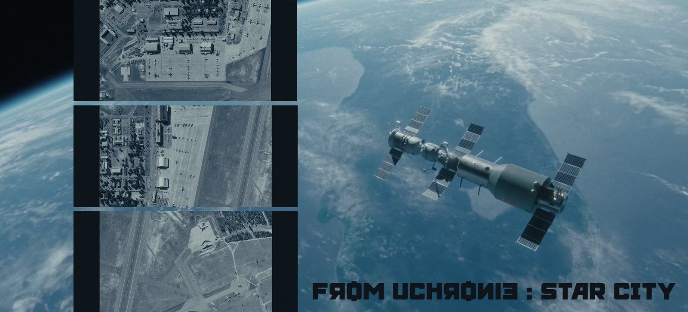{height="190" fig-alt="A space station in orbit and satellite images of a base, in the series Star City"}

**A tour of the aerial photography museum**

::: {.defiler commande="haut"}
- 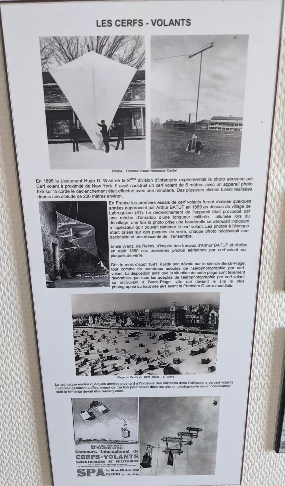
- 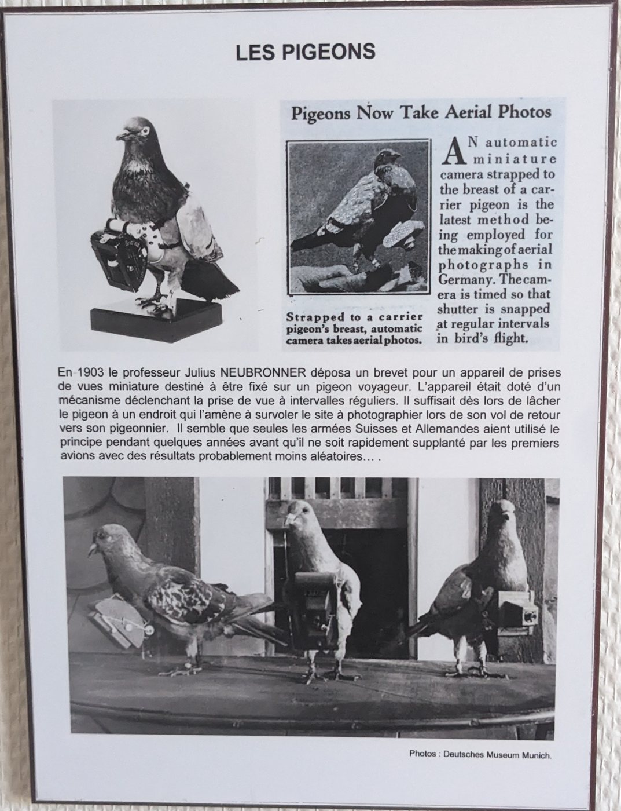
- 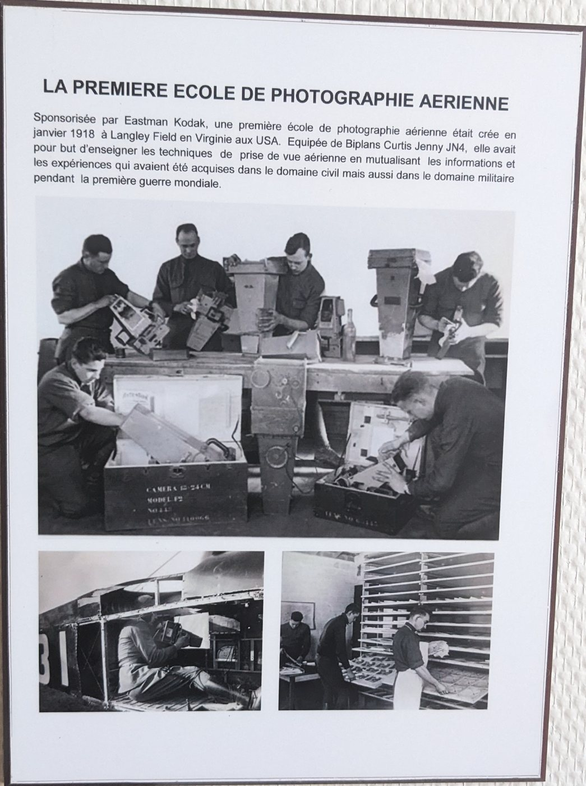
- 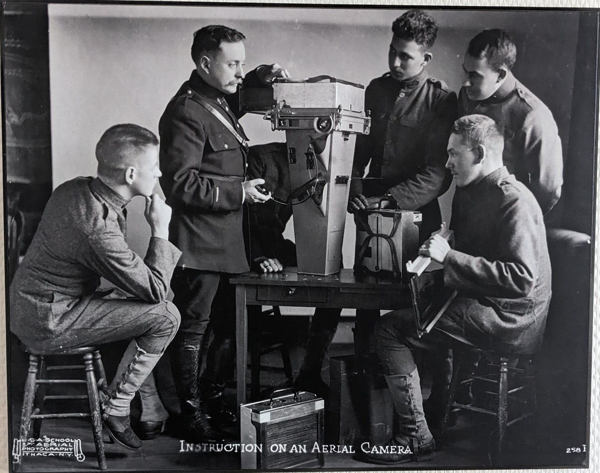
- 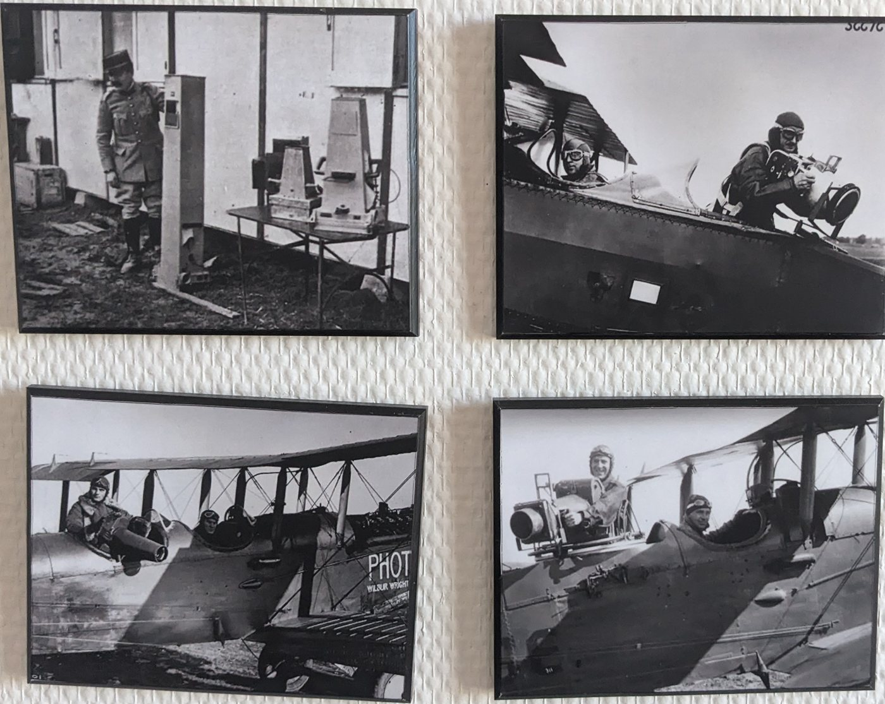
- 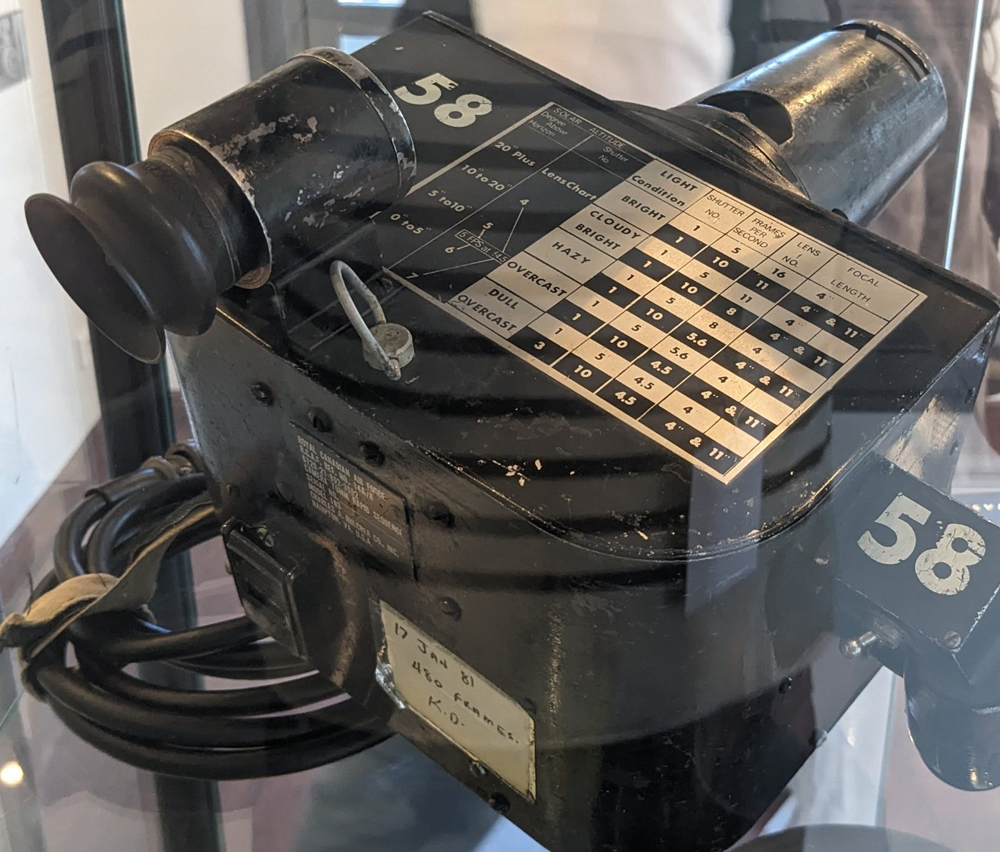
- 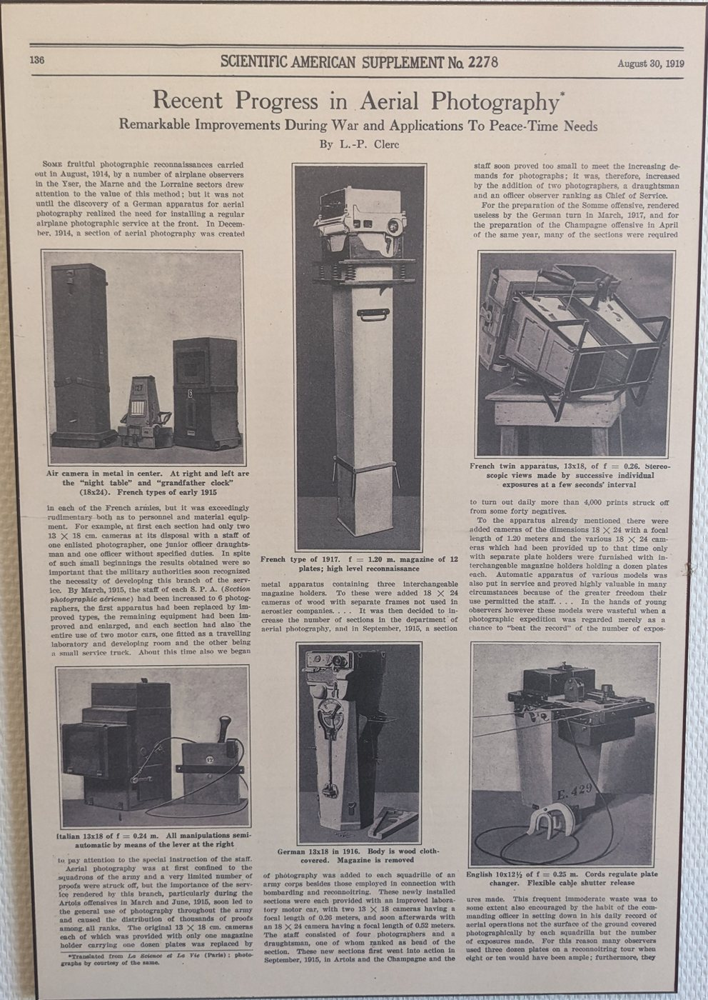
- 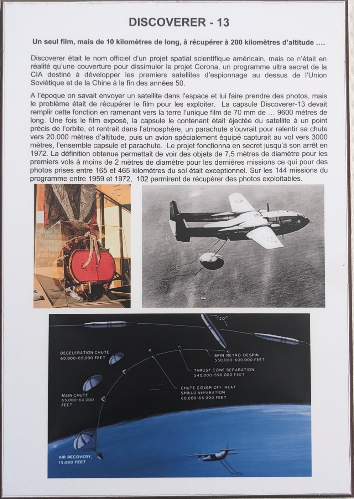
:::

[Aerial photography museum of the company L'Europe vue du Ciel. Photos: Marc Poupée. Panels in French.]{.legende}
:::

## Your turn: what is it? {.appui competences="C1 C2 C3"}

::: {.fiche n="1.5" etat="a-revoir"}
Intention : Replaying the scene on a real image, revealed clue by clue; the object is named only at the end. The conclusion no longer appears with the last clue, but at the next click, after the certainty. [V0 feedback: the FAST radio telescope is kept for the topographic profile (it would break its suspense); another example is to be chosen. Suggestions: an RAF photograph of Peenemünde (if it does not give the serious game away), the aircraft-carrier mock-ups in the Taklamakan desert (Maxar, 2021), an Area 51 site.]
Experience : riddle with progressive clues, with certainty at each clue ("indices" brick)
Request : choose the image for the riddle
:::

[Riddle to come: the image is still to be chosen (the radio telescope is kept for the topographic profile).]{.legende}

The principle: an image, clues that come one by one, and your certainty at each clue. The object is named only at the end.

## Stating your certainty {.socle competences="C3"}

::: {.fiche n="1.6" etat="a-revoir"}
Intention : An interpretation without a degree of confidence is an opinion. Sherman Kent's "words of estimative probability" (CIA, 1964); the IPCC does the same in its reports. The exercise merges the student's certainty with the statement's: each sentence is completed with a word of certainty, on the image of the radio telescope, still unnamed. [V0 feedback: link with the IPCC scale; a single certainty, in the sentences, instead of two; four sentences suggested by Marc.]
Experience : sentences to complete with a word of certainty ("phrases" brick); bonus: the IPCC scale
Request :
:::

:::: {.columns}
::: {.column width="38%"}
In 1964, Sherman Kent, a CIA analyst, proposed matching words and odds:

| Word | Odds |
|---|---|
| Almost certain | about 9 in 10 |
| Probable | about 3 in 4 |
| Possible | about 1 in 2 |
| Unlikely | about 1 in 3 |

[A word of certainty commits you: it tells the reader what risk they take in believing you.]{.a-retenir}
:::
::: {.column width="62%"}
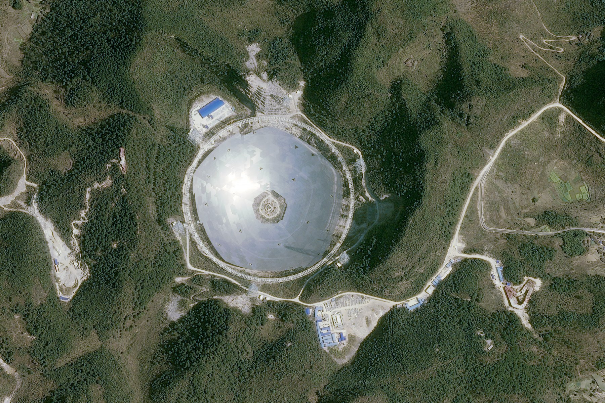{height="235" fig-alt="Satellite image of a large silver disc at the bottom of a wooded hollow, with blue-roofed buildings"}

::: {.phrases}
- It is {almost certain|=probable|possible|unlikely} that there are workers on the site : nobody can be seen, but the blue-roofed workers' camp is there.
- It is {=almost certain|=probable|possible|unlikely} that construction is under way : bare earthworks, new tracks, a workers' camp: the clues converge.
- It is {almost certain|probable|possible|=unlikely} that we are in the United States : these sugar-loaf hills and blue roofs rather point to southern China.
- It is {almost certain|probable|possible|=unlikely} that this image comes from an AI : the roads lead somewhere, the shadows are consistent.
:::
:::
::::

::: {.plus titre="The IPCC, too"}
IPCC reports describe the likelihood of an outcome with fixed terms, in italics in the text: *virtually certain* (99-100%), *very likely* (90-100%), *likely* (66-100%), *more likely than not* (over 50%), *about as likely as not* (33-66%), *unlikely* (0-33%), *very unlikely* (0-10%), *exceptionally unlikely* (0-1%). This terminology has been applied consistently since the Fifth Assessment Report (AR5).

[Source: Belgian federal climate portal, climat.be, "Rapports du GIEC" (in French).](https://climat.be/changements-climatiques/changements-observes/rapports-du-giec)
:::

## When the image deceives {.veille competences="C3"}

::: {.fiche n="1.7" etat="a-revoir"}
Intention : The counter-example: on 5 February 2003, at the UN Security Council, Colin Powell, US Secretary of State, presents satellite images as proof of chemical weapons in Iraq; they will never be found. Confirmation bias: we see what we are looking for. [V0 feedback: an archive image (one of the satellite slides shown that day, to be supplied: it cannot be downloaded from this environment); Colin Powell's portrait (Wikipedia).]
Experience : question: which step of the method was missing?
Request : supply an archive image of the 5 February 2003 presentation
:::

:::: {.columns}
::: {.column width="24%"}
{height="250" fig-alt="Official portrait of Colin Powell, Secretary of State"}

[Colin Powell, US Secretary of State (official portrait).]{.legende}
:::
::: {.column width="76%"}
On 5 February 2003, at the UN Security Council, **Colin Powell** presents satellite images as proof of chemical weapons in Iraq. The weapons will never be found.

[Archive image to come: one of the satellite slides shown that day.]{.legende}

::: {.question}
**Which step of the method was missing?**
:::

::: {.reponse}
Looking for the clue that **contradicts**, and stating the real **certainty**. A truck near a bunker has many possible explanations; the one expected is chosen. This is **confirmation bias**.
:::
:::
::::

## From image to data {.intercalaire}

::: {.fiche n="2.0" etat="a-revoir"}
Intention : Interpretation is not only for intelligence: it produces most geographic data. [new]
Experience : none
Request :
:::

Interpretation is not only for intelligence: it makes most maps.

## Interpreting to build a database {.socle competences="C5"}

::: {.fiche n="2.1" etat="a-revoir"}
Intention : National databases born of image interpretation: BD TOPO (photogrammetric plotting), BD Forêt V2 (colour-infrared orthophotos, 0.5 ha, 32 classes, 2007-2018, automatic segmentation then checks by photo interpreters), CORINE Land Cover in Europe (25 ha). [new]
Experience : question: why do three databases not say the same thing about the same place?
Request :
:::

:::: {.columns}
::: {.column width="55%"}
- **BD TOPO**: buildings, roads, rivers, plotted from aerial photographs in relief.
- **BD Forêt V2** (IGN, 2007-2018): forests interpreted on colour-infrared photographs, 32 types, no patch under **0.5 ha**.
- **CORINE Land Cover**: Europe's land cover, no patch under **25 ha**.
:::
::: {.column width="45%"}
::: {.question}
**Why do three databases not say the same thing about one place?**
:::

::: {.reponse}
They do not share the same question, the same nomenclature, or the same **minimum mapping unit**. A database is an interpretation, made according to rules.
:::
:::
::::

## The minimum mapping unit {.socle competences="C5"}

::: {.fiche n="2.2" etat="a-revoir"}
Intention : Every database sets an area below which nothing is mapped. On real data supplied by Marc, around the forest of L'Isle-Adam (8.5 × 7.9 km): CORINE Land Cover (25 ha) and BD Forêt V2 (0.5 ha). Computed on the two screenshots: 50% and 52% forest, but 12% of the area in disagreement (320 ha of forest for CLC only, 510 ha for BD Forêt only); 7 forest patches against 139. [V0 feedback: real data, and a more complex question.]
Experience : compare the two maps (slider); two-part question
Request :
:::

:::: {.columns}
::: {.column width="50%"}
::: {.comparer}
- 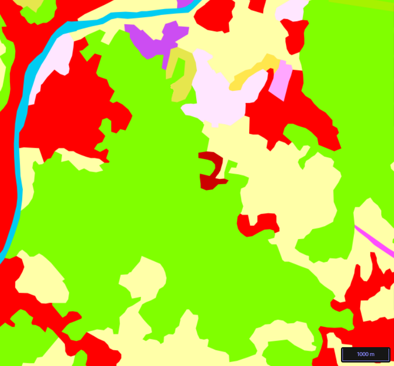
- 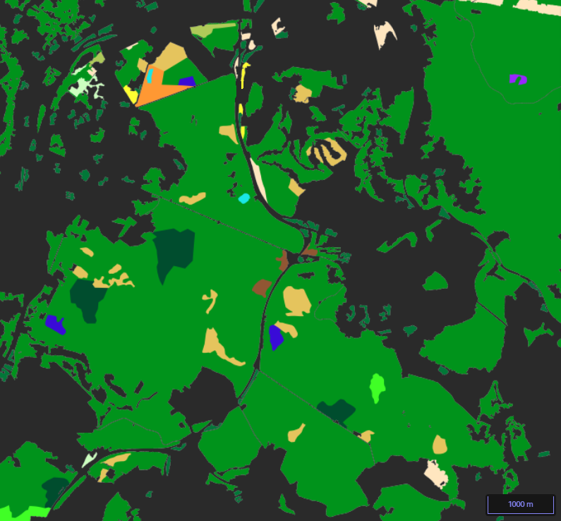
:::
:::
::: {.column width="50%"}
Forest of L'Isle-Adam: **CORINE Land Cover** (25 ha minimum; forest in light green) and **BD Forêt V2** (0.5 ha; forests in greens).

::: {.question}
**50% forest for one, 52% for the other: do they agree? Which one for a municipality, which one to compare Europe?**
:::

::: {.reponse}
They agree on the total, not on the places: they differ on **12%** of the area (830 ha). CORINE draws 7 forest patches, BD Forêt **139**. Municipality: BD Forêt; Europe: CORINE, same rules everywhere. [Computed on the screenshots.]{.legende}
:::
:::
::::

## What is a forest? {.appui competences="C5"}

::: {.fiche n="2.3" etat="a-revoir"}
Intention : A nomenclature starts with definitions. Students build a definition of forest from three criteria (minimum area, tree height, cover), then find out whether such a definition exists: FAO, UNFCCC (Kyoto), BD Forêt V2, CORINE Land Cover, COMIFAC. Checked thresholds: FAO 0.5 ha, 5 m, 10%; UNFCCC, each country chooses between 0.05 and 1 ha, 2 and 5 m, 10 and 30%; BD Forêt V2 0.5 ha, 5 m, 20 m wide, aligned with FAO; CORINE 25 ha, over 5 m, at least 30%; COMIFAC (Ernst et al., 2010) 5 ha, 5 m, 70%. [V0 feedback: the nomenclature of the course image becomes the definition of forest, suggested by Marc: three series of items to combine.]
Experience : build a definition, then compare it with official definitions ("combiner" brick)
Request :
:::

Build **your** definition of a forest: one choice per row. Then see whether it exists.

::: {.combiner}
### Minimum area

- 0.05 ha [kyoto]
- 0.5 ha [fao, kyoto, bdforet]
- 5 ha [comifac]
- 25 ha [clc]

### Tree height

- 2 m [kyoto]
- 5 m [fao, kyoto, bdforet, clc, comifac]
- 15 m []

### Tree cover

- 10% [fao, kyoto, bdforet]
- 30% [kyoto, clc]
- 70% [comifac]

#### fao | FAO (world statistics)

Over 0.5 ha, trees over 5 m, a cover of over 10%.

#### kyoto | Climate (UNFCCC, Kyoto Protocol)

Each country chooses its thresholds within ranges: 0.05 to 1 ha, 2 to 5 m, 10 to 30% cover.

#### bdforet | BD Forêt V2 (IGN, France)

0.5 ha, trees over 5 m, at least 20 m wide; aligned with FAO.

#### clc | CORINE Land Cover

A minimum mapping unit of 25 ha; a forest has trees over 5 m and a cover of at least 30%.

#### comifac | Central African forests (COMIFAC)

At least 70% cover, trees of at least 5 m, a minimum mapping unit of 5 ha.

#### * | No known definition

None of the definitions kept here combines these three choices. Yet there are hundreds: every country, every database, every convention sets its own thresholds. A map of "the" forest always says **which** forest.
:::

## How accurate are experts? {.appui competences="C5 C6"}

::: {.fiche n="2.4" etat="a-revoir"}
Intention : One of Marc's slides on expert accuracy. It starts with "How certain are you of yourself?", voted with a slider: the expected answer is close to 95% (depending on age, progress in a field, tiredness, we do not always agree with ourselves: points developed orally). An expert is considered as such at 95%. Then four categories of accuracy in geographic information production, orders of magnitude given by Marc: expert photo interpreter 95%, expert classification highly variable, machine learning 80 to 85%, neural network 92%. The question on disagreements between interpreters stays. [V0 feedback: replaces "Two interpreters, two maps"; bonus: Colwell, 1952, on the links between military and forest photo interpretation.]
Experience : vote with the slider; answer, and the chart appears; question on disagreements; bonus
Request :
:::

:::: {.columns}
::: {.column width="44%"}
::: {.question}
**How certain are you of yourself?** If you interpreted the same image twice, a month apart, on how many points would you agree?
:::

::: {.curseur min="50" max="100" pas="1" valeur="75" unite="%" etiquette="My agreement with myself"}
:::

::: {.reponse}
About **95%**: age, practice, tiredness… we do not always agree with ourselves. It is the threshold of an expert.
:::
:::
::: {.column width="56%"}
::: {.schema fichier="images/schemas/en/precision.svg" hauteur="250"}
:::

[Orders of magnitude in geographic information production (Marc Poupée).]{.legende}

::: {.question}
**Two interpreters: where do they most often disagree?**
:::

::: {.reponse}
At **boundaries**, on **small objects**, on **cases the rules did not foresee**.
:::
:::
::::

::: {.plus titre="Soldiers and foresters"}
Military and forest photo interpreters have shared a lot: same keys, same methods. R. N. Colwell (US Naval Photographic Interpretation Center), "Relationships Between Military and Forest Photo Interpretation", *Journal of Forestry*, 50 (4), 1952, pp. 271-276. [The paper](https://academic.oup.com/jof/article/50/4/271/4684240)
:::

## Data to teach machines {.appui competences="C6"}

::: {.fiche n="2.5" etat="a-revoir"}
Intention : AI learns from images labelled by people. FLAIR (Garioud, Gonthier, Landrieu, De Wit, Valette, Poupée, Giordano, Wattrelos, NeurIPS 2023): over 20 billion labelled pixels, 817 km² of 20 cm aerial imagery, with satellite time series. The interpreter becomes an annotator. Marc's reflection, kept here and not on the slide: AI takes in labelled data, not data being labelled; the interpreter's decision process is unknown. Including the margin of certainty in training data would be an interesting lead. [V0 feedback: AI learns the errors, not the hesitations; the orthophoto and its labels side by side.]
Experience : look at the image and its labels; question; bonus: the paper
Request :
:::

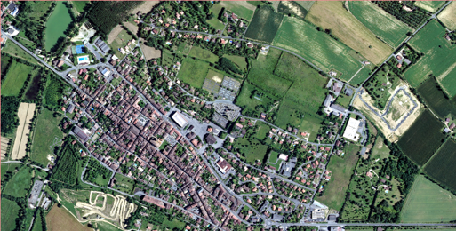{height="215" fig-alt="Orthophoto of a small town surrounded by fields"} 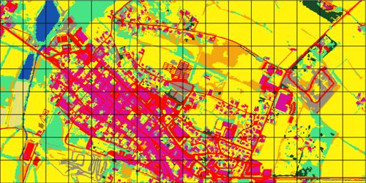{height="215" fig-alt="The same area, each pixel coloured by its land cover"}

[The image, and its pixel-by-pixel labels. The **FLAIR** dataset (IGN, 2023): over 20 billion labelled pixels, across 817 km² of 20 cm imagery.]{.legende}

::: {.question}
**Who makes these labels, and what does the machine learn from them?**
:::

::: {.reponse}
Interpreters, pixel by pixel, following rules. The machine learns their final decisions, **errors included**; their hesitations, it never sees.
:::

::: {.plus titre="The FLAIR paper"}
A. Garioud, N. Gonthier, L. Landrieu, A. De Wit, M. Valette, M. Poupée, S. Giordano, B. Wattrelos, "FLAIR: a Country-Scale Land Cover Semantic Segmentation Dataset From Multi-Source Optical Imagery", *NeurIPS 2023, Datasets and Benchmarks*. [The paper](https://arxiv.org/abs/2310.13336) · [the data](https://ignf.github.io/FLAIR/)
:::

## The interpreter checks the machine {.appui competences="C6"}

::: {.fiche n="2.6" etat="a-revoir"}
Intention : Validating an automatic result relies on a sample interpreted by hand: right and wrong classifications are counted (the confusion matrix, in plain words). Illustration: building detection by a U-Net network, work from 2019. [V0 feedback: Marc's two U-Net illustrations, dated 2019.]
Experience : look at the detection; multiple choice with a certainty bar
Request :
:::

:::: {.columns}
::: {.column width="46%"}
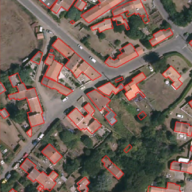{height="230" fig-alt="Orthophoto of a residential area, buildings outlined in red"} 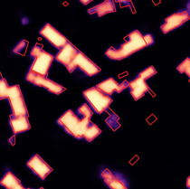{height="230" fig-alt="The network's building detection: light patches on black, reference outlines in red"}

[Left, the reference buildings (in red); right, what a U-Net network detects: the lighter, the surer. Work from 2019.]{.legende}
:::
::: {.column width="54%"}
An AI maps buildings. Out of 100 random points, an interpreter checks: **90 are right**.

::: {.confiance}
::: {.qcm .serre}
What can be concluded?

- [ ] The map is 90% right, everywhere
    - No: errors may cluster somewhere (dark roofs, dense areas).
- [x] On this territory, about 9 points in 10 are right; we must look at where the errors are
    - Yes: the overall figure is not enough, the distribution of errors class by class is needed.
- [ ] The interpreter is no longer needed
    - No: the interpreter produced the check.
:::
:::
:::
::::

## Tracking change {.appui competences="C4"}

::: {.fiche n="2.7" etat="a-revoir"}
Intention : Tracking change, here with radar (Baltimore): a colour composite of several dates. Radar sees at night and through clouds, but does not read like a photograph. Source and dates of the image to be given by Marc. [new]
Experience : question
Request :
:::

:::: {.columns}
::: {.column width="52%"}
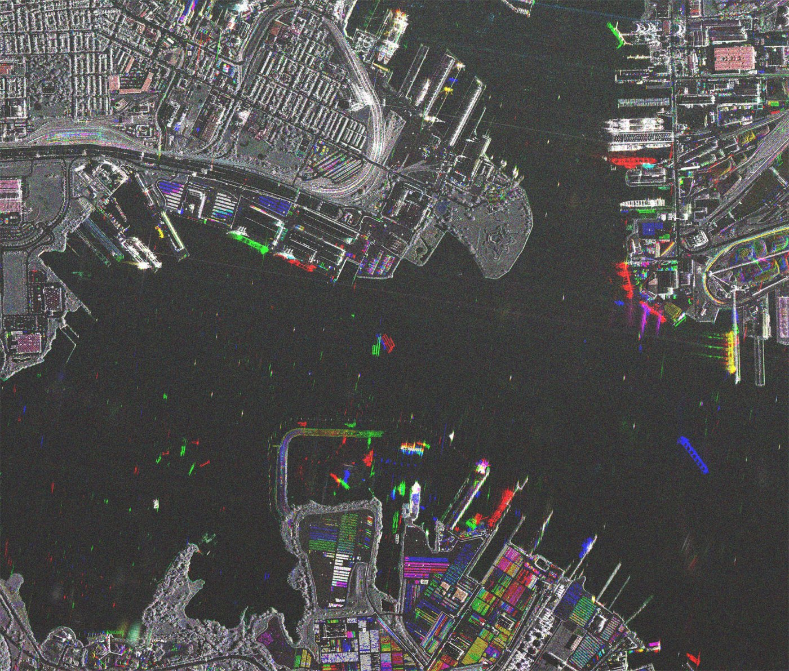{height="430" fig-alt="Radar image of the port of Baltimore, grey with colour patches"}

[Port of Baltimore, radar image, several dates. Source to be added.]{.legende}
:::
::: {.column width="48%"}
This image stacks several radar dates, each in one colour.

::: {.question}
**What do grey and the colours mean?**
:::

::: {.reponse}
**Grey** is what did not change between the dates. **Colours** are what moved: ships, containers, vehicles. Radar sees at night and through clouds, but it must be learnt.
:::
:::
::::

## Archaeology under the forest {.appui competences="C4"}

::: {.fiche n="2.8" etat="a-revoir"}
Intention : Airborne LiDAR reveals the Khmer cities around Angkor under the forest (2012 campaign; Evans et al., PNAS, 2013). Marc's image, source Wired (June 2013). The link with IGN is still to be specified by Marc. [V0 feedback: the Angkor LiDAR image.]
Experience : question
Request : specify the link with IGN
:::

:::: {.columns}
::: {.column width="58%"}
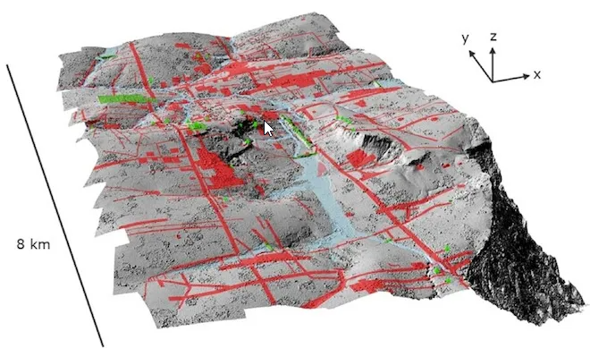{width="100%" fig-alt="Relief model of the ground around Angkor, with a network of straight red lines"}

[The ground relief around Angkor, revealed by LiDAR; in red, the ancient features. Source: Wired, June 2013.]{.legende}
:::
::: {.column width="42%"}
In 2012, an airborne **LiDAR** flies over Angkor. Its laser pulses pass between the leaves and reach the ground: under the forest, streets, ponds and whole districts appear.

::: {.question}
**Why was an aerial photograph not enough?**
:::

::: {.reponse}
It only shows the forest canopy. LiDAR also measures what lies beneath: the ground relief, and the traces of ancient works.
:::
:::
::::

## Many other uses {.appui competences="C4"}

::: {.fiche n="2.9" etat="a-revoir"}
Intention : The gallery of uses, for a wide audience, in four categories of the same register: crisis management, land cover monitoring, quality control, geopolitics. [V0 feedback: "monitoring and control" and "verification" were vague and not in the same register; the examples are kept, sorted into Marc's four categories.]
Experience : sort eight questions by use
Request :
:::

Sort each question by the use of interpretation.

::: {.classer}
### Crisis management

- Which buildings did the flood destroy?
- How far did the fire go?

### Land cover monitoring

- How many fields were built over in ten years?
- Where was the forest felled this year?

### Quality control

- Was this photo really taken here, on that day?
- Is this map made by an AI right?

### Geopolitics

- Is a refugee camp growing?
- Is a military base expanding?
:::

## The identification keys {.intercalaire}

::: {.fiche n="3.0" etat="a-revoir"}
Intention : What the object is. The course image: the Flamanville power plant (Manche, France), during construction of the EPR, an image that brings all the keys together. [new]
Experience : none
Request :
:::

What the object is.

## The course image

::: {.fiche n="3.1" etat="a-revoir"}
Intention : The whole image, explored freely before any key. Students describe, then suggest for each element a cautious interpretation, with a word of certainty. The expert reading is broken down the same way, without saying what the site is. Description taken up in the final note. Example, no level. [V0 feedback: break down the expert reading: an observation ⇒ an interpretation and its certainty, on Marc's model ("large surfaces, apparently flat, with colours from brown to green ⇒ very probably fields").]
Experience : magnifier; writing box ("observer" brick)
Request :
:::

:::: {.columns}
::: {.column width="46%"}
::: {.loupe zoom="3"}
{height="460" fig-alt="Orthophoto of an industrial site by the sea"}
:::
:::
::: {.column width="54%"}
Explore the image with the magnifier. **Describe** what you see: shapes, colours, sizes, positions. Then, for each element, what it **probably** is, with a word of certainty. You will find this text again at the end.

::: {.observer cle="description-image" invite="I see… ⇒ it is probably…"}
- Large surfaces, apparently flat, from brown to green, edged with dark lines ⇒ **very probably** fields bordered by hedges.
- A line of large pale blocks closing a turquoise body of water ⇒ **very probably** a breakwater and a basin.
- Stringy white patches at sea, far from shore ⇒ **probably** rough water.
- Two grey discs about fifty metres across, a third copper-coloured one, surrounded by long thin shapes ⇒ **probably** domes, one under construction, with cranes.
- Long rectangular volumes, aligned at right angles ⇒ **very probably** industrial buildings.
- Rows of small coloured rectangles on grey ⇒ **almost certainly** cars in car parks.
:::
:::
::::

## Tone and colour {.socle competences="C2 C4"}

::: {.fiche n="3.2" etat="a-revoir"}
Intention : The first and simplest key: tone (light, dark) and colour. The turquoise water of the basin, the white boils, the copper dome of the construction site. In colour infrared, living vegetation turns red. [new]
Experience : multiple choice: what does the whiteness of the boils reveal?
Request :
:::

:::: {.columns}
::: {.column width="45%"}
{height="380" fig-alt="The course image"}
:::
::: {.column width="55%"}
**Tone** (light or dark) and **colour** are the first keys the eye reads. In **colour infrared**, living vegetation turns red: diseased plants show up.

::: {.qcm .serre}
At sea, on the left, two large white patches. What does their whiteness say?

- [x] Rough water full of bubbles: turbulence
    - Yes: foam reflects light. It remains to find what stirs the water.
- [ ] Sand under the water
    - No: sand would give a pale, even colour, without these filaments.
- [ ] Clouds
    - No: they would cast their shadow on the water.
:::
:::
::::

## Size and shape {.socle competences="C2"}

::: {.fiche n="3.3" etat="a-revoir"}
Intention : Size is read with the scale (200 m ≈ 130 pixels on the image: about 1.5 m per pixel, measured); shape separates the natural from the human-made. A dome is about 50 m across (measured). [V0 feedback: to keep the suspense, the answer does not yet say it is a reactor.]
Experience : measuring question
Request :
:::

:::: {.columns}
::: {.column width="45%"}
::: {.loupe zoom="3"}
{height="400" fig-alt="The course image, with its scale bar"}
:::
:::
::: {.column width="55%"}
**Size** is read with the scale; **shape** separates the natural (irregular outlines) from the human-made (geometry). A perfect dome of this size has few explanations.

::: {.question}
The scale bar at the bottom left is 200 m long. **How wide are the domes?**
:::

::: {.reponse}
About **50 m**: a quarter of the scale bar. A dome of this size, by the sea… Keep your hypothesis to yourself: the interpretation keys will put it to the test.
:::
:::
::::

## Texture and pattern {.socle competences="C2"}

::: {.fiche n="3.4" etat="a-revoir"}
Intention : Texture (the grain) and pattern (the repeated arrangement). The rough breakwater of large blocks; the hedged fields in a mesh; car parks in rows. [new]
Experience : sort six details by the key that reveals them
Request :
:::

**Texture** is the grain of a surface; **pattern** is the arrangement of repeated elements.

::: {.classer}
### Texture

- The breakwater, rough like gravel
- The sea, smooth offshore and stringy near the boils
- The construction site, grainy

### Pattern

- Fields in a mesh, bordered by hedges
- Cars in rows in the car parks
- Buildings aligned at right angles
:::

## The shadow tells the shape {.socle competences="C2"}

::: {.fiche n="3.5" etat="a-revoir"}
Intention : Cast shadows: from the air, a tall thin object is just a dot; its shadow draws its silhouette. Diagrams made for the course: a wind turbine, a water tower, a power pylon, a crane, shadows stretched by a low sun in the south-east; the object must be inferred from its shadow. Reading shadows has a name in French photo interpretation: "sciographie" (shadow marks, used again in archaeology). [V0 feedback: an important part of Marc's handout that had disappeared; diagrams redrawn from scratch.]
Experience : match each shadow to its object (sort); names appear on the diagram with the correction
Request :
:::

From the air, a tall thin object is just a dot. Its **cast shadow**, however, draws its silhouette: reading shadows is a key of its own.

::: {.schema fichier="images/schemas/en/ombres-portees.svg" hauteur="225"}
:::

::: {.classer}
### Shadow A

- A wind turbine

### Shadow B

- A water tower

### Shadow C

- A power pylon

### Shadow D

- A crane
:::

## Shadow and relief {.socle competences="C2 C4"}

::: {.fiche n="3.6" etat="a-revoir"}
Intention : Shadow and light give relief. Mini-game (Marc's request): on the image of the radio telescope, still unnamed, a walker goes from A to B through the centre; students make him climb or descend with the keyboard arrows, and mark sharp ridges (C key): elsewhere the curve rounds itself. They then compare with the reference profile. The reference profile is indicative, to be validated (or taken from a DEM). [V0 feedback: start in the middle of the vertical axis; judging by the switchbacks, the first slope climbs steeply to a ridge, then goes down towards the centre; curve smoothed live, breaking ridges and rounded bottoms told apart; the deduction of the dish's shape follows, next slide.]
Experience : topographic profile mini-game ("coupe" brick)
Request :
:::

Draw the profile from **A** to **B**: at each step, make the walker climb or descend according to the image; mark the **sharp ridges** (C key): elsewhere the curve rounds itself. Switchbacks, shadows and glints tell you where the slopes are.

::: {.coupe image="images/fast-2016.jpg" alt="A large silver disc at the bottom of a wooded hollow, between hills" depart="2,49" arrivee="98,49" pas="24" profil="donnees/fast-profil.json" style="--hauteur-coupe: 320px"}
::: {.apres-jeu}
Dashed, the reference profile: a steep slope up to a ridge, then down towards the disc. **In the centre, a hollow or a bump?** Prove it, next slide. [Indicative profile, read from the image.]{.legende}
:::
:::

## Hollow or bump? {.socle competences="C2 C3"}

::: {.fiche n="3.7" etat="a-revoir"}
Intention : The step that deduces the dish's shape (Marc's request): 1. find where the sun is; 2. find a sundial (the tower at the bottom right of the disc and its shadow); 3. deduce the shape: the sun's reflection is on the side opposite the sun, so the dish is concave. On a dome, the reflection would be on the sun's side. The object is finally named: the FAST radio telescope. [V0 feedback: deduction step that was missing after the profile.]
Experience : riddle with clues, with certainty at each clue ("indices" brick)
Request :
:::

::: {.indices image="images/fast-2016.jpg" alt="The large silver disc, its tower and its reflection" confiance="oui" style="--hauteur-indices: 420px"}
- 46,59,13,8 : A sundial: the tower at the bottom right of the disc, and its thin shadow running left, across the disc.
- So the sun is on the right of the image, slightly low: opposite the shadow.
- 34,38,9,11 : The sun's reflection on the disc is up and to the left of the centre: on the side opposite the sun.
- On a bump, the reflection would be on the sun's side; in a hollow, it is on the opposite side.

The disc is **concave**: a hollow 500 m across, set at the bottom of a karst depression. It is the **FAST radio telescope** (Guizhou, China), the largest single-dish antenna in the world, caught by Pléiades on 2 March 2016, at the end of construction.
:::

## The date matters {.appui competences="C2 C4"}

::: {.fiche n="3.8" etat="a-revoir"}
Intention : The date of an image sets what can be seen on it: construction under way, the season, the tide, the time of day (length and direction of shadows). A reminder with images is planned (Marc's image to come). Bonus: OSINT and chronolocation. [V0 feedback: a reminder with images; link to OSINT and chronolocation; the image is no longer named.]
Experience : multiple choice with a certainty bar; bonus
Request : supply the image for the reminder
:::

The date tells the **state** of a place: a construction site, a season, a tide, a time of day.

[Reminder with images to come (Marc's image).]{.legende}

::: {.confiance}
::: {.qcm .serre}
On the course image, the shadows of the buildings fall to the right (east). What do you make of it?

- [ ] The photo was taken in the morning
    - No: in the morning the sun is in the east and shadows fall to the west.
- [x] The photo was taken in the afternoon
    - Yes: the sun is in the west or south-west, shadows point east.
- [ ] Nothing can be said about the time
    - Yes it can: the direction of shadows gives the position of the sun.
:::
:::

::: {.plus titre="OSINT and chronolocation"}
**OSINT** (*open source intelligence*) is intelligence drawn from open sources: published images, videos, maps. **Chronolocation** is one of its branches: dating an image from its clues, the length and direction of shadows first. Tools such as [SunCalc](https://www.suncalc.org) give the sun's position for a place, a day, a time; the [Bellingcat](https://www.bellingcat.com) collective publishes its investigations and methods.
:::

## Which key for which question? {.socle competences="C2"}

::: {.fiche n="3.9" etat="a-revoir"}
Intention : A recap of the identification keys, mixed (interleaved practice). [new]
Experience : multiple choice with a certainty bar
Request :
:::

::: {.confiance}
::: {.qcm .serre}
To tell whether a tall chimney is higher than a nearby block of flats, on a single vertical photograph, which key?

- [ ] Tone
    - No: it tells the material or the lighting, not the height.
- [ ] Shape
    - No: seen from above, a chimney is just a disc.
- [x] Shadow
    - Yes: at the same time of day, the longest shadow belongs to the tallest object.
- [ ] Pattern
    - No: it concerns repeated elements.
:::
:::

[Tone and colour, size, shape, texture, pattern, shadow, date: seven keys to say **what** an object is.]{.a-retenir}

## The interpretation keys {.intercalaire}

::: {.fiche n="4.0" etat="a-revoir"}
Intention : What is going on. From recognised objects to the mechanisms that link them. [new]
Experience : none
Request :
:::

What is going on.

## Association {.socle competences="C3"}

::: {.fiche n="4.1" etat="a-revoir"}
Intention : Objects that go together: domes, turbine halls, water intake, outfall at sea, construction site. One object alone is ambiguous; an association hardly is. This is where the nature of the site is revealed. Zone coordinates to be checked. [V0 feedback: question and answer were ambiguous; association now comes before site, so that the reveal comes from the association; the question on a new place follows, next slide.]
Experience : clickable zones: find what goes with the domes; question: what do they form?
Request :
:::

:::: {.columns}
::: {.column width="50%"}
An **association** is a set of objects that go together. A dome alone could be a planetarium, a silo, a radome… Look on the image for what goes with the domes: where water comes in, where it goes out, what is being built.

::: {.question}
**Together, what do these objects form?**
:::

::: {.reponse}
A **nuclear power plant** by the sea: Flamanville (Manche, France), with its third reactor, the EPR, under construction. No single object proved it; their association almost does.
:::
:::
::: {.column width="50%"}
::: {.zones image="images/flamanville.jpg" alt="The course image" hauteur="440"}
- [x] 53,46,7,17 : The two domes: reactor buildings.
- [x] 47,43,6,18 : The long buildings next to them: turbine halls, turbines and condensers.
- [x] 42,23,7,46 : The basin closed by the breakwater: the sea-water intake.
- [x] 1,22,22,52 : The boils offshore: the cooling-water outfall.
- [x] 56,31,8,10 : The third dome, under construction: one more reactor, the EPR.
- [ ] 84,26,14,22 : The hedged farmland: it was there before the site.
:::
:::
::::

## Your turn: what is this place? {.appui competences="C3"}

::: {.fiche n="4.2" etat="a-revoir"}
Intention : Transferring the association key to another place: a riding centre in L'Isle-Adam (Marc's image). Marc's question: "Which associations let us infer the nature of this place?" [V0 feedback: question added after association, on Marc's Centre_equestre image. Choice: a separate slide rather than a question appearing on the same slide, to keep the image large and the PDF readable.]
Experience : question, then answer
Request :
:::

:::: {.columns}
::: {.column width="56%"}
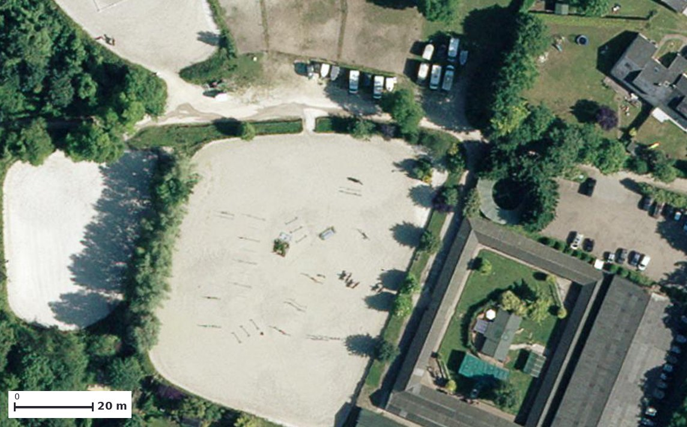{width="100%" fig-alt="Aerial view: two large areas of pale sand, long buildings around a courtyard, a car park"}
:::
::: {.column width="44%"}
::: {.question}
**Which associations let us infer the nature of this place?**
:::

::: {.reponse}
Sand arenas dotted with **jump poles**; small figures (**riders?**); buildings around a courtyard (**stables?**); long vehicles parked (**horseboxes?**). Together: a **riding centre**.
:::
:::
::::

## Site {.socle competences="C3"}

::: {.fiche n="4.3" etat="a-revoir"}
Intention : The position of an object in its surroundings explains what happens to it. Why a power plant here? Sea water; rocky ground; and distance from the population: the Cotentin peninsula, the sheltering cliff, and probably (Marc's assumption) the nearby La Hague site. Map made for the course: Flamanville, a 100 km circle, the population of municipalities (INSEE, via Etalab) and of the Channel Islands (orders of magnitude). Computed: about 730,000 inhabitants within 100 km, nearly a quarter of them on the islands; four fifths of the circle are at sea. [V0 feedback: spell out the distance from the population, with a simple map and a 100 km circle; site now comes after association, which reveals the nature of the place.]
Experience : map; question
Request :
:::

:::: {.columns}
::: {.column width="48%"}
**Site**: the place of an object in its surroundings.

::: {.question}
**Why build a power plant here?**
:::

::: {.reponse}
- **Sea water**, plentiful and cold;
- **rocky** ground, below a sheltering **cliff**;
- **distance from the population**: the 100 km circle is 4/5 sea (about 730,000 inhabitants);
- probably **La Hague**, 15 km away: a region already nuclear (hypothesis).
:::
:::
::: {.column width="52%"}
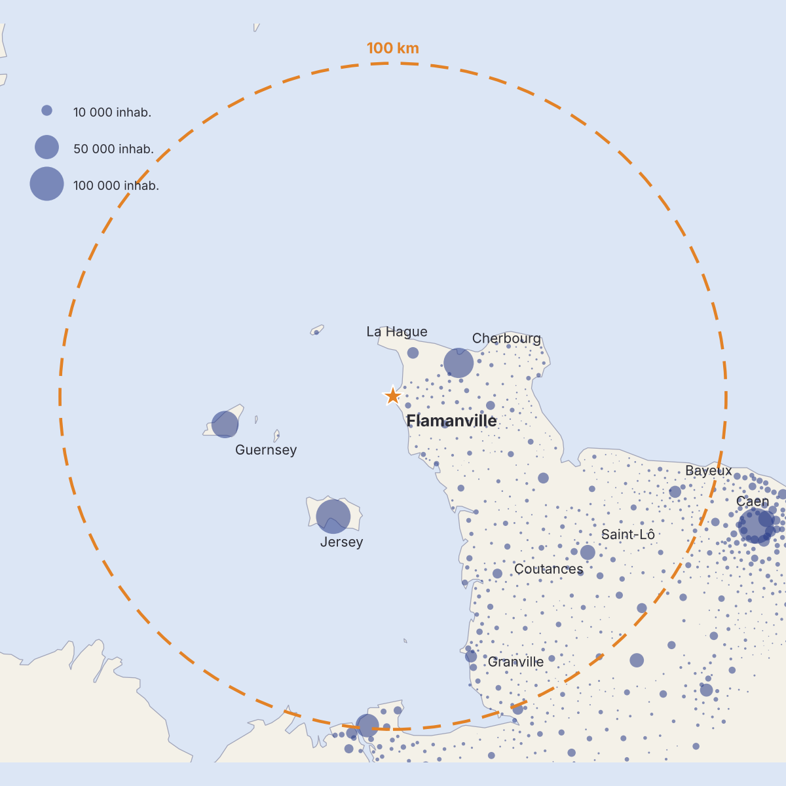{height="430" fig-alt="Map of the Cotentin and the Channel Islands: a 100 km circle around Flamanville, circles proportional to the population of municipalities"}

[Population: INSEE, via Etalab; islands: orders of magnitude; land: Natural Earth.]{.legende}
:::
::::

## Time {.socle competences="C3 C4"}

::: {.fiche n="4.4" etat="a-revoir"}
Intention : Time: an image freezes one moment of a process; comparing several dates of the same place reveals a dynamic. Marc suggests an animated GIF from the Ukrainian crisis, where Russian bases grow: the question will be about what changes, and in what order. [V0 feedback: the question was too simple; Marc's GIF to come.]
Experience : watch the animation; question
Request : supply the GIF of the Russian bases
:::

An image freezes a **moment**. To understand a mechanism, look for what tells the before and the after: a construction site, a flood, a felling, regrowth. Several dates of the same place reveal a **dynamic**.

[Animation to come: Russian bases growing, before the invasion of Ukraine (Marc's GIF).]{.legende}

::: {.question}
**What changes from one image to the next, and in what order?**
:::

::: {.reponse}
Answer to be written with the animation.
:::

## Personal knowledge and reflexes {.appui competences="C1 C4"}

::: {.fiche n="4.5" etat="a-revoir"}
Intention : What interpreters bring themselves: their knowledge and their reflexes. The Cambrai-1917 image, as visible as possible; "What do you see?", then "Which questions should you ask?": which place (Cambrai)? which date (1917)? which signal (panchromatic)? which film reference ("All Quiet on the Western Front" or "Wonder Woman", take your pick)? [V0 feedback: new slide requested by Marc, after time.]
Experience : two questions, each followed by its answer
Request :
:::

:::: {.columns}
::: {.column width="56%"}
::: {.loupe zoom="2.5"}
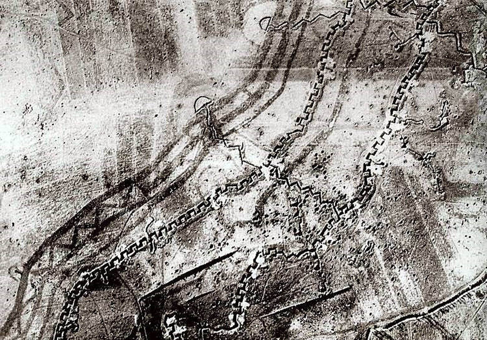{height="285" fig-alt="Old black-and-white aerial photograph: crenellated zigzag lines on ground riddled with holes"}
:::

::: {.question}
**What do you see?**
:::

::: {.reponse}
Crenellated **trenches**, **shell holes**, wide dark bands: **probably barbed wire**.
:::
:::
::: {.column width="44%"}
::: {.question}
**Which questions should you ask?**
:::

::: {.reponse}
- **Which place?** Cambrai.
- **Which date?** 1917.
- **Which signal?** Panchromatic.
- **Which film?** *All Quiet on the Western Front* or *Wonder Woman*, take your pick.
:::
:::
::::

## What vegetation and grazing light reveal {.socle competences="C2 C3"}

::: {.fiche n="4.6" etat="a-revoir"}
Intention : The indirect clues of aerial archaeology: crop marks (the crop grows better over a filled-in ditch, taller and greener; poorly over a buried wall, shorter and yellowing early, above all in a dry summer) and shadow marks (a levelled bank casts a shadow in grazing light, early morning or late evening). There are others: soil marks (colour of ploughed fields, in winter), damp marks. Diagram made for the course. [V0 feedback: important parts of Marc's handout that had disappeared (in French: "indices phytographiques" and "sciographiques").]
Experience : diagram; multiple choice; question
Request :
:::

:::: {.columns}
::: {.column width="52%"}
::: {.schema fichier="images/schemas/en/indices-archeo.svg" hauteur="300"}
:::
:::
::: {.column width="48%"}
::: {.qcm .serre}
Dry summer, wheat field: a greener, taller circle appears. What lies beneath?

- [x] A filled-in ditch, which holds moisture
    - Yes: a positive crop mark; an ancient enclosure, perhaps.
- [ ] A buried wall
    - No: over a wall, the crop grows poorly and turns yellow.
- [ ] Nothing: irrigation
    - Unlikely: irrigation does not draw a thin, regular circle.
:::

::: {.question}
**When should you photograph a bank levelled to 30 cm?**
:::

::: {.reponse}
In **grazing light**, early morning or late evening: the slightest relief casts a shadow. It is a **shadow mark**.
:::
:::
::::

## The chronology of features {.socle competences="C3"}

::: {.fiche n="4.7" etat="a-revoir"}
Intention : Reading relative chronology on a single image: what cuts across is younger than what it cuts; what lines up on a feature came after it. Invented landscape, diagram made for the course: a filled-in meander, a straight road, strip fields aligned on the road, a railway cutting across the strips, a motorway crossing it on a bridge, a housing estate under construction. [V0 feedback: an important part of Marc's handout that had disappeared.]
Experience : diagram; put six features in order
Request :
:::

:::: {.columns}
::: {.column width="56%"}
::: {.schema fichier="images/schemas/en/chronologie.svg" hauteur="340"}
:::

[**What cuts across is younger** than what it cuts; what lines up on a feature came after it.]{.a-retenir}
:::
::: {.column width="44%"}
::: {.ordre}
From oldest to most recent:

1. A, the filled-in meander
2. B, the straight road
3. C, the strip fields
4. D, the railway
5. E, the motorway
6. F, the housing estate under construction
:::
:::
::::

## Reconstructing a mechanism {.socle competences="C3"}

::: {.fiche n="4.8" etat="a-revoir"}
Intention : Converging clues tell a complete mechanism: the cooling water circuit, from intake to outfall, and the electricity leaving. Each step is linked to a clue in the image. How the Flamanville outfall works to be validated by Marc. [new]
Experience : put the steps in order
Request :
:::

::: {.ordre}
Put the mechanism of the power plant in order. Each step has its clue in the course image.

1. Sea water enters the basin closed by the breakwater
2. Pumps send it to the turbine halls
3. It cools the steam that drove the turbines
4. Warmed, it goes back to sea through tunnels
5. It rises offshore: the white boils
6. The electricity leaves through the high-voltage lines
:::

## Reasoning step by step {.socle competences="C1 C3"}

::: {.fiche n="4.9" etat="a-revoir"}
Intention : A deduction tree on the Brest roadstead: what is happening inside the red dashes? Each choice is a clue; the path taken stays on screen, like a bundle. First version: the tree will be rebuilt from the answers of Marc's students, and its conclusions validated by him. [new]
Experience : deduction tree ("arbre" brick)
Request :
:::

What is happening inside the **red dashes**? Answer step by step: each answer is a clue.

::: {.arbre image="images/rade-de-brest.jpg" alt="Orthophoto of the Brest roadstead, a red dashed area on the water" style="--hauteur-arbre: 390px"}
### depart | How big are the small white dots? (scale: 200 m)
- A few metres → petits
- Several tens of metres → grands

### grands ! Measure again
With the scale, 200 m is about 126 pixels: a dot of 3 or 4 pixels measures a few metres. Go back one step.

### petits | How are they spread?
- Scattered, fairly evenly spaced → espaces
- Lined up in straight rows → rangees
- Packed in a group, all heading the same way → groupe

### espaces | Do they all point the same way?
- Yes, all the same way → mouillage
- No, at random → flottants

### mouillage ! Hypothesis: a mooring area
Boats on their moorings, all turned by the same current or wind, near the shore. To confirm: a slipway, a club, a harbour nearby? Conclusion to be validated.

### rangees ! Hypothesis: shellfish or seaweed farming
Buoys lined up on longlines. To confirm: sheds on shore, access tracks? Conclusion to be validated.

### groupe ! Hypothesis: a regatta
Sailing boats moving as a fleet. To confirm: wakes, a course mark? Conclusion to be validated.

### flottants ! Hypothesis: floating objects
Buoys, debris or birds. To confirm with a second date. Conclusion to be validated.
:::

## Traps {.appui competences="C3"}

::: {.fiche n="4.10" etat="a-revoir"}
Intention : False friends (a shadow taken for water, a meadow for a construction site) and confirmation bias. The counter: look for the clue that contradicts. [new]
Experience : multiple choice with a certainty bar; the calibration at the end shows whether you are over-confident
Request :
:::

::: {.confiance}
::: {.qcm .serre}
A large dark patch at the foot of a tall building, on an image taken late in the afternoon. What is it?

- [ ] A pond, no doubt
    - Too quick: a cast shadow is just as dark, and it has the shape of the building.
- [x] Probably its shadow: check its shape and direction
    - Yes: at that time shadows are long; if the patch extends the building in the direction of the other shadows, it is a shadow.
- [ ] A car park
    - Nothing suggests it: no cars, no markings.
:::
:::

[The counter to confirmation bias: look for the clue that **contradicts** your hypothesis.]{.a-retenir}

## Real or generated? {.intercalaire}

::: {.fiche n="5.0" etat="a-revoir"}
Intention : Detecting AI-generated images: the interpreter's keys apply. The third major strand of the course (Marc's request); placed after the keys, which are used to detect. [new]
Experience : none
Request :
:::

The interpreter's keys also unmask generated images.

## Four years ago {competences="C6"}

::: {.fiche n="5.1" etat="a-revoir"}
Intention : In January 2022, an "aerial view" generated by Wombo Dream: Marc's students saw an Asian landscape in it, because it was unthinkable that an image could be made up. We do not detect what we do not imagine. Example, no level. [V0 feedback: image cropped without the app's mentions, and enlarged; generally, make visuals as large as possible.]
Experience : question before the answer
Request :
:::

:::: {.columns}
::: {.column width="40%"}
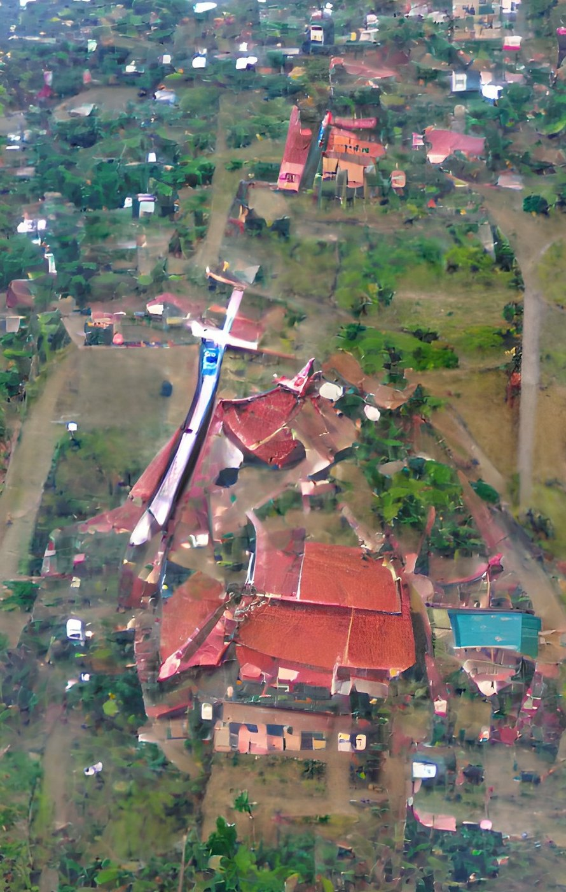{height="540" fig-alt="An aerial view of a village with red roofs"}
:::
::: {.column width="60%"}
::: {.question}
**Where was this aerial view taken?**
:::

::: {.reponse}
Nowhere: it was generated in January 2022 by an app, from the words *aerial view* alone. At the time, students saw an Asian landscape in it: it was unthinkable that an image could be made up.
:::

[We do not detect what we do not imagine possible.]{.a-retenir}
:::
::::

## Physical errors {.socle competences="C6 C3"}

::: {.fiche n="5.2" etat="a-revoir"}
Intention : Physical and topographic inconsistencies, revealed by the interpretation keys: rivers crossing ridges, contradictory lighting, relief crumpled like paper (DALL·E, 2024). [V0 feedback: larger images.]
Experience : scroll; question
Request :
:::

:::: {.columns}
::: {.column width="54%"}
::: {.defiler commande="haut" style="--hauteur-image: 420px"}
- 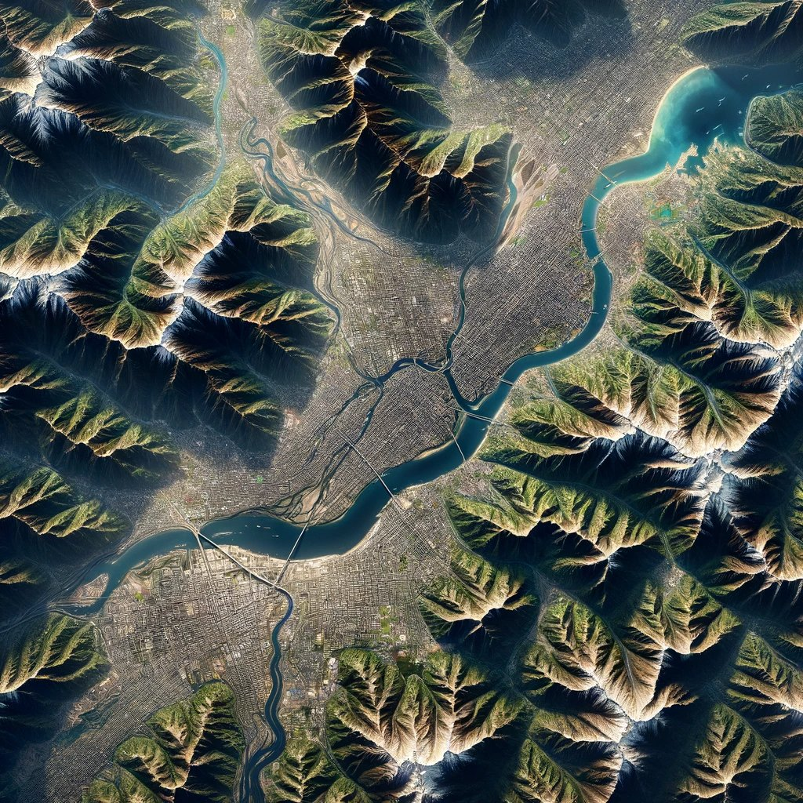
- 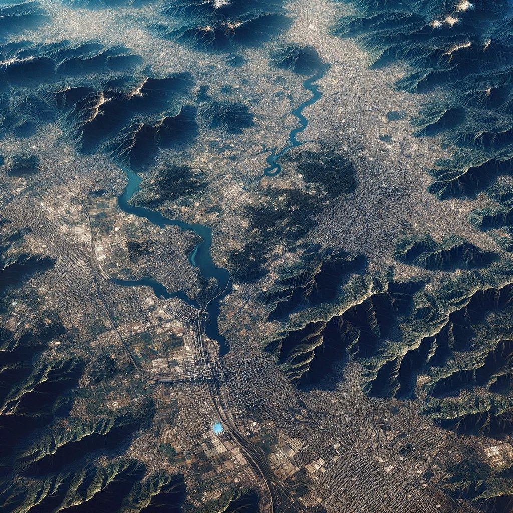
- 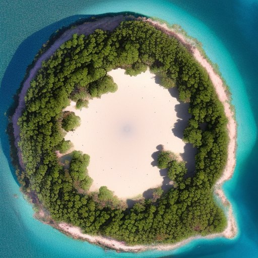
:::
:::
::: {.column width="46%"}
::: {.question}
These views from above were generated. **What gives them away?**
:::

::: {.reponse}
- **Rivers** that do not follow valleys, or cross ridges.
- **Lighting** coming from several sides at once.
- **Relief** with no erosion logic, crumpled like paper.
- A **town** with no network: roads lead nowhere.
:::
:::
::::

## The implausible {.appui competences="C6"}

::: {.fiche n="5.3" etat="a-revoir"}
Intention : A fabricated "historical" image: Tiananmen Square seen from a drone. Anachronism (no consumer drones in 1989), tanks with inconsistent shapes. The keys of time and shape. Generation date to be specified. [V0 feedback: larger image.]
Experience : question
Request :
:::

:::: {.columns}
::: {.column width="52%"}
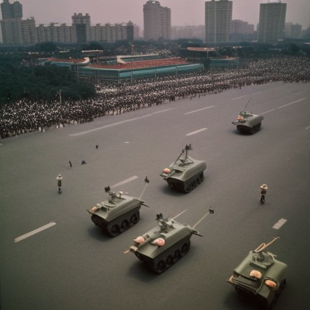{height="520" fig-alt="Tanks on a large square, seen from above"}
:::
::: {.column width="48%"}
::: {.question}
An image captioned "Tiananmen, 1989, seen from a drone". **How many clues contradict it?**
:::

::: {.reponse}
- The **date**: in 1989, no drone films a protest like this.
- The **shapes**: tanks with inconsistent turrets and tracks.
- The **people**: figures with no proper shadow.

Three converging inconsistencies: the image is fake.
:::
:::
::::

## The missing emotion {.appui competences="C6"}

::: {.fiche n="5.4" etat="a-revoir"}
Intention : The lack of emotion in generated faces and scenes: the posters on a kiosk photographed by Marc (PXL_20250930_173652676~2). [V0 feedback: Marc's image, large.]
Experience : question
Request : confirm which posters are generated
:::

:::: {.columns}
::: {.column width="66%"}
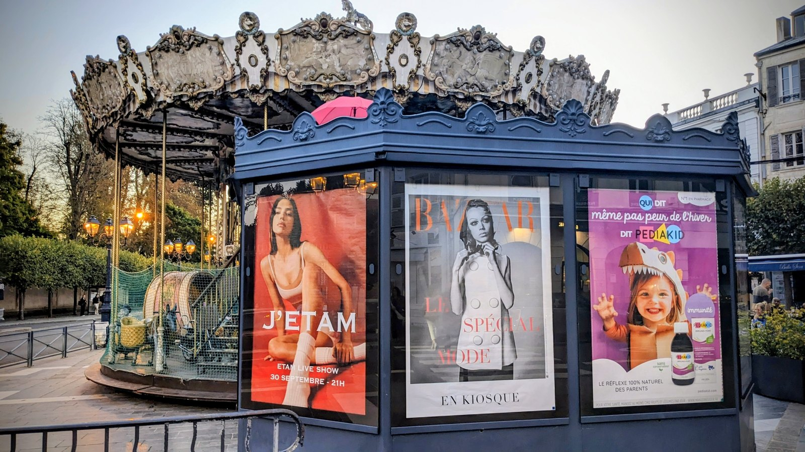{width="100%" fig-alt="A kiosk covered in advertising posters, in front of a carousel"}
:::
::: {.column width="34%"}
::: {.question}
**Look at the faces on the posters. What do they lack to look real?**
:::

::: {.reponse}
**Emotion**: smooth, frozen faces, a gaze that responds to nothing. A weak clue on its own, but a common one in generated images.
:::
:::
::::

## What still gives AI away {.socle competences="C6 C2"}

::: {.fiche n="5.5" etat="a-revoir"}
Intention : What remains today: difficult textures (fur, wrinkles), inconsistent blurred backgrounds, simplified high-spatial-frequency structures typical of convolutional networks. Marc's images: PXL_20261006_182859009 and PXL_20261006_182903643. [V0 feedback: Marc's two images, large.]
Experience : look at the two images; list of weak points
Request :
:::

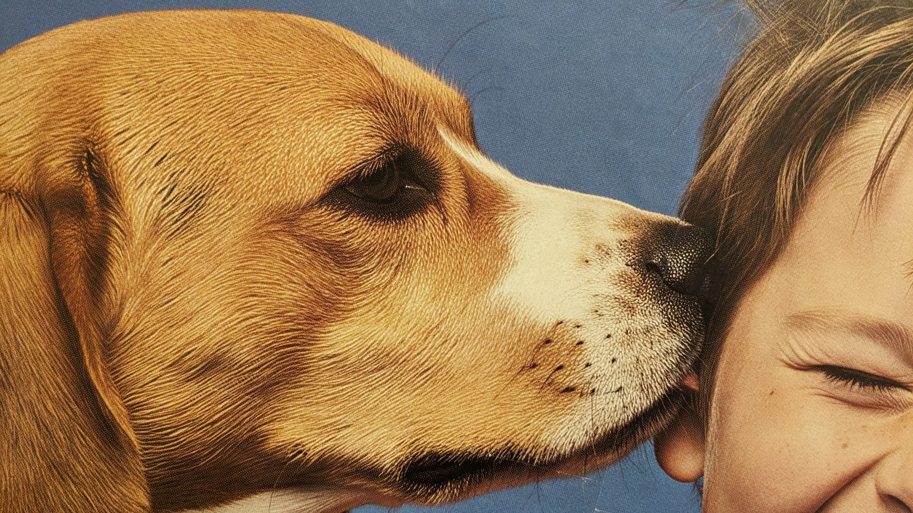{height="290" fig-alt="A dog licks a boy's cheek"} {height="290" fig-alt="A boy laughs, eyes screwed up"}

The weak points that remain, to look for with a magnifier:

- fine, disordered **textures**: fur, hair, wrinkles;
- **blurred backgrounds** whose blur does not follow distance;
- **fine details** (high frequencies), simplified into over-regular motifs: the signature of convolutional networks.

## The real that looks fake {competences="C6"}

::: {.fiche n="5.6" etat="a-revoir"}
Intention : The wink: an unusual real image that now looks generated (IMG-20261029-WA0000, Marc's image). Doubt spreads to real images. Example, no level. [V0 feedback: Marc's image, large.]
Experience : question
Request :
:::

:::: {.columns}
::: {.column width="36%"}
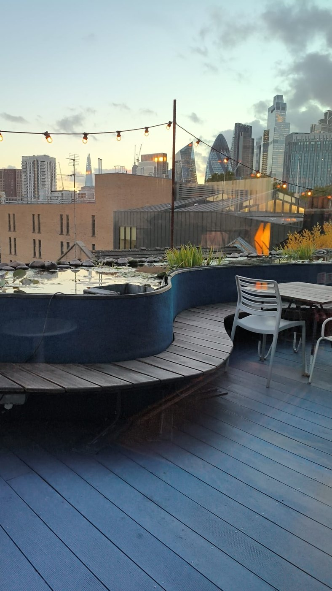{height="540" fig-alt="A wooden terrace, string lights and skyscrapers in the distance"}
:::
::: {.column width="64%"}
::: {.question}
**Generated, or real?**
:::

::: {.reponse}
Real. Now an unusual image looks fake: doubt spreads to real images. The only answer is the method: the source, the date, the converging clues.
:::
:::
::::

## Your turn: real or generated? {.appui competences="C6"}

::: {.fiche n="5.7" etat="a-revoir"}
Intention : The test: real images (Pléiades, orthophotos, radar) and generated ones (2022 to 2024), one at a time, with certainty each time. To be enriched with Marc's 2025 and 2026 images. [new]
Experience : "vrai-ia" brick, with certainty bar and score
Request :
:::

For each image: real, or generated? State your certainty first.

::: {.vrai-ia style="--hauteur-vraiia: 420px"}
- 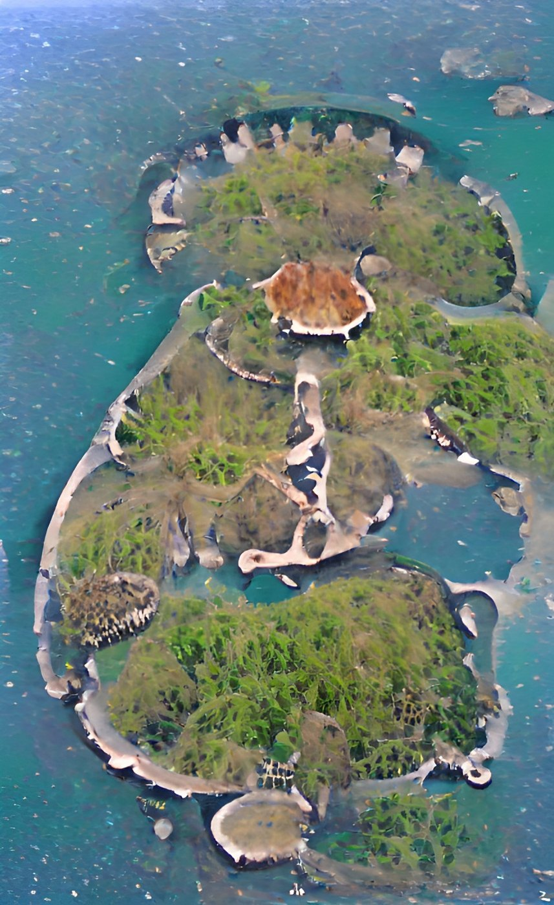 [ai] : Lace-like shores with no logic, buildings melted into the vegetation, no road.
-  [real] : A Pléiades image: roads lead somewhere, shadows are consistent, the construction site makes sense.
-  [ai] : A flat white lagoon, with no depth or pass, ball-shaped vegetation: physically unlikely.
- 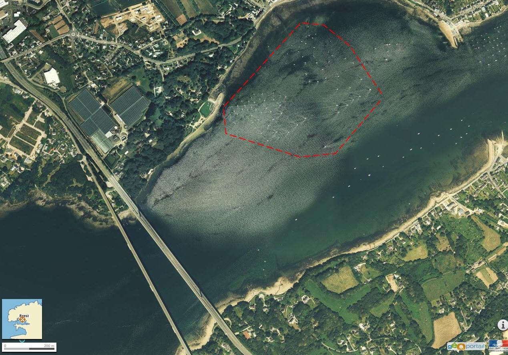 [real] : An orthophoto: a continuous road network, aligned shadows, irregular details.
-  [ai] : Rivers crossing ridges and relief with no erosion.
-  [real] : A multi-date radar image: its flaws are those of the sensor, not of a generator.
:::

## The method {.socle competences="C6 C3"}

::: {.fiche n="5.8" etat="a-revoir"}
Intention : The verification method: source and provenance (metadata, content credentials), reverse image search, consistency with other images of the same place and day, converging clues. Never a single clue. [new]
Experience : put the steps in order
Request :
:::

::: {.ordre}
Put the verification of an image in order.

1. Where does it come from? Who published it, when, with what metadata?
2. Has it circulated before? (reverse image search)
3. Are the place and date consistent? (other images, the sun, the season)
4. Do the identification and interpretation keys hold? (shapes, textures, shadows, physics)
5. Conclude with a degree of certainty
:::

[No clue proves anything alone: a bundle, and a stated certainty.]{.a-retenir}

## The interpretation note {.intercalaire}

::: {.fiche n="6.0" etat="a-revoir"}
Intention : Writing up the investigation. [new]
Experience : none
Request :
:::

Writing up the investigation.

## Writing a note {.socle competences="C1 C3"}

::: {.fiche n="6.1" etat="a-revoir"}
Intention : The note in four headings (observations, interpretations, certainty, sources and limits), on the course image. The description written in 3.1 comes back. Link with "Cartography: Basics": clearly, honestly. [new]
Experience : the description comes back; the student writes the note, then compares it with the expert's ("observer" brick)
Request :
:::

An interpretation note has **four headings**: what I see; what I infer; how sure I am; on what sources, with what limits.

::: {.observer cle="note-image" rappel="description-image" invite="Observations… Interpretations… Certainty… Sources and limits…"}
**Observations.** A rocky coast, a breakwater enclosing a basin, two domes about 50 m across and a third under construction, long buildings, boils offshore, power lines.

**Interpretations.** A nuclear power plant by the sea, cooled by sea water (intake in the basin, outfall offshore), with a third reactor under construction.

**Certainty.** Almost certain for the power plant (a bundle of clues); probable for the water circuit (the tunnels cannot be seen).

**Sources and limits.** One orthophoto, one date; the outfall is inferred, not seen.
:::

## Your turn: a new image {.appui competences="C1 C2 C3 C4"}

::: {.fiche n="6.2" etat="a-revoir"}
Intention : Transfer to an image from another sensor: the port of Baltimore in radar. An interpretation note without guidance, then the expert reading. Reading to be completed by Marc. [new]
Experience : writing box, then expert reading ("observer" brick)
Request :
:::

:::: {.columns}
::: {.column width="45%"}
{height="430" fig-alt="Multi-date radar image of the port of Baltimore"}
:::
::: {.column width="55%"}
Write your note on this radar image, with its four headings.

::: {.observer cle="note-baltimore" invite="Observations… Interpretations… Certainty… Sources and limits…"}
**Observations.** Quays, basins, a grid-pattern town; grey almost everywhere; colour patches on the water and on the quaysides.

**Interpretations.** The colours mark what changed between the dates: ships arriving or leaving, containers moved. Grey, what stayed put.

**Certainty.** Probable: we would need to know which colour matches which date.

**Sources and limits.** A radar image, whose source and dates are to be added.
:::
:::
::::

## Revising {.intercalaire}

::: {.fiche n="7.0" etat="a-revoir"}
Intention : What remains, and how to make it last. [new]
Experience : none
Request :
:::

What remains, and how to make it last.

## Key points

::: {.fiche n="7.1" etat="a-revoir"}
Intention : The core slides, in one list.
Experience : links to each slide
Request :
:::

::: {.carte-du-cours niveaux="socle"}
:::

[See, then infer; cross-check the clues; state your certainty.]{.a-retenir}

## Your self-assessment

::: {.fiche n="7.2" etat="a-revoir"}
Intention : The starting grid comes back: the student places themselves again, sees the gap, and the slides to work on again; their calibration (certainty and success). [new]
Experience : final self-assessment ("bilan" brick); calibration table ("calibration" brick)
Request :
:::

:::: {.columns}
::: {.column width="62%"}
::: {.bilan moment="fin"}
- C1 | Describe before interpreting
- C2 | Identify with the identification keys
- C3 | Reconstruct a mechanism and state its certainty
- C4 | Choose the image that answers the question
- C5 | Turn an interpretation into data
- C6 | Tell a real image from a generated one
:::
:::
::: {.column width="38%"}
**Your calibration**

::: {.calibration}
:::
:::
::::

## The revision programme

::: {.fiche n="7.3" etat="a-revoir"}
Intention : The revision mode: all the questions in the course, mixed; a known card is spaced out (a day, a week, a month), a missed card comes back. Principle: retrieve from memory, space out, interleave, judge yourself. [new]
Experience : "revision" brick; the ?revision address opens this slide directly
Request :
:::

:::: {.columns}
::: {.column width="40%"}
All the questions in the course become **cards**, mixed.

- You knew it: it comes back in **a day**, then **a week**, then **a month**.
- You had forgotten it: it comes back straight away.

Reopen this handout tomorrow, then in a week. Add `?revision` to its address to land here directly.
:::
::: {.column width="60%"}
::: {.revision}
:::
:::
::::

## Your turn {.fin}

::: {.fiche n="7.4" etat="a-revoir"}
Intention : The bridge to the photo interpretation practical.
Experience : none
Request :
:::

An image does not speak for itself: you **look** at it, **question** it, **cross-check** its clues, and **say** what you know, with your certainty.

## Sources and credits {.petit}

::: {.fiche n="7.5" etat="a-revoir"}
Intention : References: FLAIR (Marc's paper), Natural Resources Canada, the GIS&T Body of Knowledge, textbooks, Kent, the IPCC, Colwell, history (Babington Smith, Cuba), Angkor, forest definitions, aerial archaeology, the images and their rights. Marc's course PDF to be added (not received). [V0 feedback: Wikipedia for Colin Powell's portrait, Wired for Angkor, climat.be for the IPCC, Colwell (1952), the new images.]
Experience : none
Request :
:::

:::: {.columns}
::: {.column width="50%"}
| Document | Origin |
|---|---|
| Interpretation elements | Natural Resources Canada, *Elements of visual interpretation*; S. Myint, GIS&T BoK, DC-04-012, 2024; Lillesand, Kiefer and Chipman, 2015 |
| FLAIR | Garioud *et al.*, NeurIPS 2023; FLAIR images, IGN |
| Certainty | S. Kent, 1964; IPCC, after climat.be |
| Experts | R. N. Colwell, *Journal of Forestry*, 1952; orders of magnitude: M. Poupée |
| History | C. Babington Smith; Smithsonian; timeline: M. Poupée |
| Angkor | D. Evans *et al.*, PNAS, 2013; image: Wired, June 2013 |
| Forest | FAO; UNFCCC; IGN, BD Forêt V2 (online conference, 19 January 2021); Copernicus, CLC; COMIFAC, after ATIBT, 2018 |
| Aerial archaeology | R. Agache; crop marks and shadow marks |
:::
::: {.column width="50%"}
| Document | Origin |
|---|---|
| Flamanville, Brest roadstead, riding centre | Géoportail, IGN |
| L'Isle-Adam | CORINE Land Cover; BD Forêt V2, IGN |
| FAST | Pléiades image, 2 March 2016 (rights to be specified) |
| Baltimore | radar image, source to be specified |
| Colin Powell | official portrait, Wikipedia |
| Cambrai, 1917 | aerial photograph, source to be specified |
| U-Net | work from 2019 |
| Generated images | Wombo Dream (2022), DALL·E (2024); photos by M. Poupée |
| Museum, Star City | L'Europe vue du Ciel; *Star City*, Apple TV+ |
| 100 km map | INSEE via Etalab; Natural Earth |
| M. Poupée's course | PDF to be added |
:::
::::

